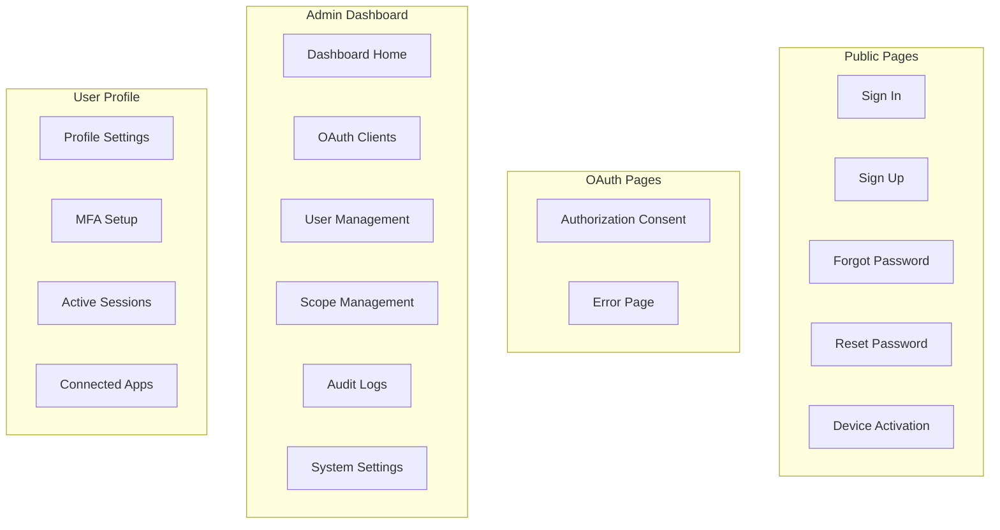

# User Interface

The Managed UI implements screens such as login, registration, account recovery, account setting, and account verification. This allows for fast adoption of Authority.

Contrary to other vendors, Authority allows you to implement your own UI by offering simple HTML templates. You can change the look of Authority pages completely.

## UI Components



## Screenshots

### Sign In Page

The sign in page provides a clean, modern login experience:


### OAuth Authorization

Users see a clear consent screen showing requested permissions:


### Device Activation

For device flow authorization, users enter the code displayed on their device:


## Template Customization

### The Public Directory

The public directory contains all the front-end CSS and HTML-related files that compose the user interface for Authority. These are small easy to understand files that are clearly named for easy adoption.

```
public/
├── templates/
│   ├── layout.html          # Base layout template
│   ├── signin.html          # Login page
│   ├── signup.html          # Registration page
│   ├── authorize.html       # OAuth consent page
│   ├── activate.html        # Device code activation
│   ├── forgot-password.html # Password reset request
│   ├── reset-password.html  # Password reset form
│   ├── errors.html          # Error messages partial
│   └── emails/              # Email templates
│       ├── verification.html
│       ├── password-reset.html
│       └── welcome.html
├── css/
│   └── styles.css           # Main stylesheet
└── js/
    └── app.js               # Client-side JavaScript
```

### HTML (Jinja) Templates

A template contains **variables** and/or **expressions**, which get replaced with values when a template is _rendered_; and **tags**, which control the logic of the template.

Below is a minimal template that illustrates a few basics using the default Jinja configuration:

```django





<main class="login-form">
  
  <form action="/signin" method="post">
    <input type="hidden" name="forward_url" id="forward_url" value="{{forward_url}}">

    <div class="avatar">
      <i class="material-icons">&#xE7FF;</i>
    </div>

    <h4 class="modal-title">Sign in to Authority</h4>
    <p class="subtitle">Secure OAuth 2.0 authentication</p>

    <div class="form-group">
      <input type="text" class="form-control" id="username" name="username"
             placeholder="Username" required="required">
    </div>

    <div class="form-group">
      <input type="password" class="form-control" id="password" name="password"
             placeholder="Password" required="required">
    </div>

    <div class="form-group small clearfix">
      <label class="form-check-label">
        <input type="checkbox" name="remember"> Remember me
      </label>
      <a href="/forgot-password" class="forgot-link">Forgot Password?</a>
    </div>

    <div class="d-grid gap-2 mx-auto">
      <input type="submit" class="btn btn-primary" id="signin" value="Sign In">
    </div>
  </form>

  <div class="text-center small">
    Don't have an account? <a href="/signup">Sign up</a>
  </div>
</main>


```

## Available Template Variables

### Sign In Page (`signin.html`)

| Variable | Description |
|----------|-------------|
| `forward_url` | URL to redirect after successful login |
| `error` | Error message if login failed |
| `username` | Previously entered username (for retry) |

### Authorization Page (`authorize.html`)

| Variable | Description |
|----------|-------------|
| `client_name` | Name of the OAuth client |
| `client_id` | Client identifier |
| `scopes` | List of requested scopes |
| `redirect_uri` | Where user will be redirected |
| `state` | CSRF state parameter |

### Device Activation (`activate.html`)

| Variable | Description |
|----------|-------------|
| `user_code` | Pre-filled user code (if provided in URL) |
| `audience` | Client/application name |
| `error` | Error message if activation failed |

## Styling Guide

Authority uses a modern dark theme by default. Key CSS variables you can customize:

```css
:root {
  /* Primary colors */
  --primary-color: #7c3aed;
  --primary-hover: #6d28d9;

  /* Background colors */
  --bg-primary: #0f172a;
  --bg-secondary: #1e293b;
  --bg-card: #1e293b;

  /* Text colors */
  --text-primary: #f8fafc;
  --text-secondary: #94a3b8;

  /* Status colors */
  --success: #22c55e;
  --warning: #f59e0b;
  --error: #ef4444;

  /* Border radius */
  --radius-sm: 0.375rem;
  --radius-md: 0.5rem;
  --radius-lg: 0.75rem;
}
```

## Email Templates

Authority sends transactional emails for:

- **Email Verification** - Confirm new account email
- **Password Reset** - Reset password link
- **Welcome Email** - New user welcome message
- **MFA Enabled** - Confirmation when 2FA is enabled

Email templates support the same Jinja syntax and can be fully customized.


Learn more about the template syntax and capabilities at [https://jinja.palletsprojects.com/en/3.0.x/templates/](https://jinja.palletsprojects.com/en/3.0.x/templates/) and [https://shards.info/github/straight-shoota/crinja](https://shards.info/github/straight-shoota/crinja)

