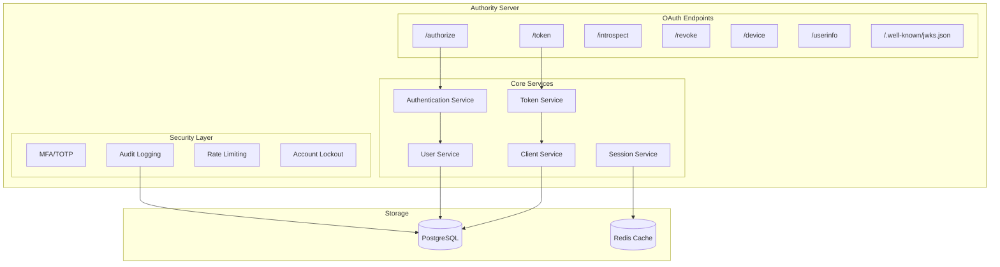
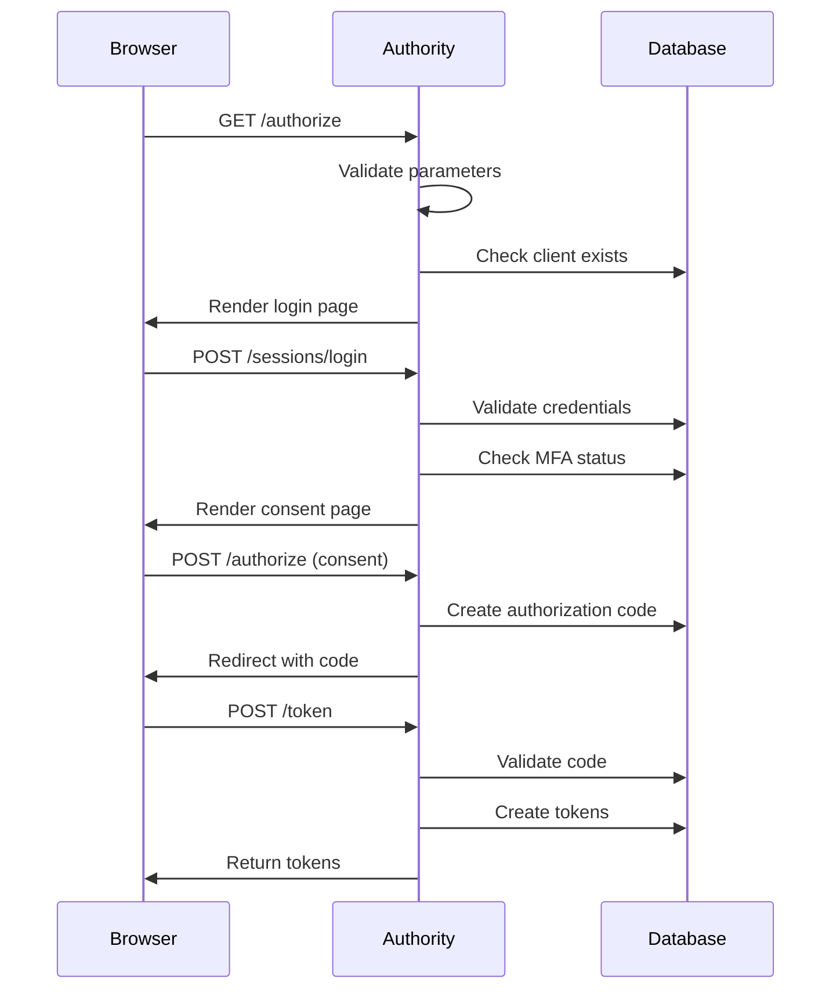
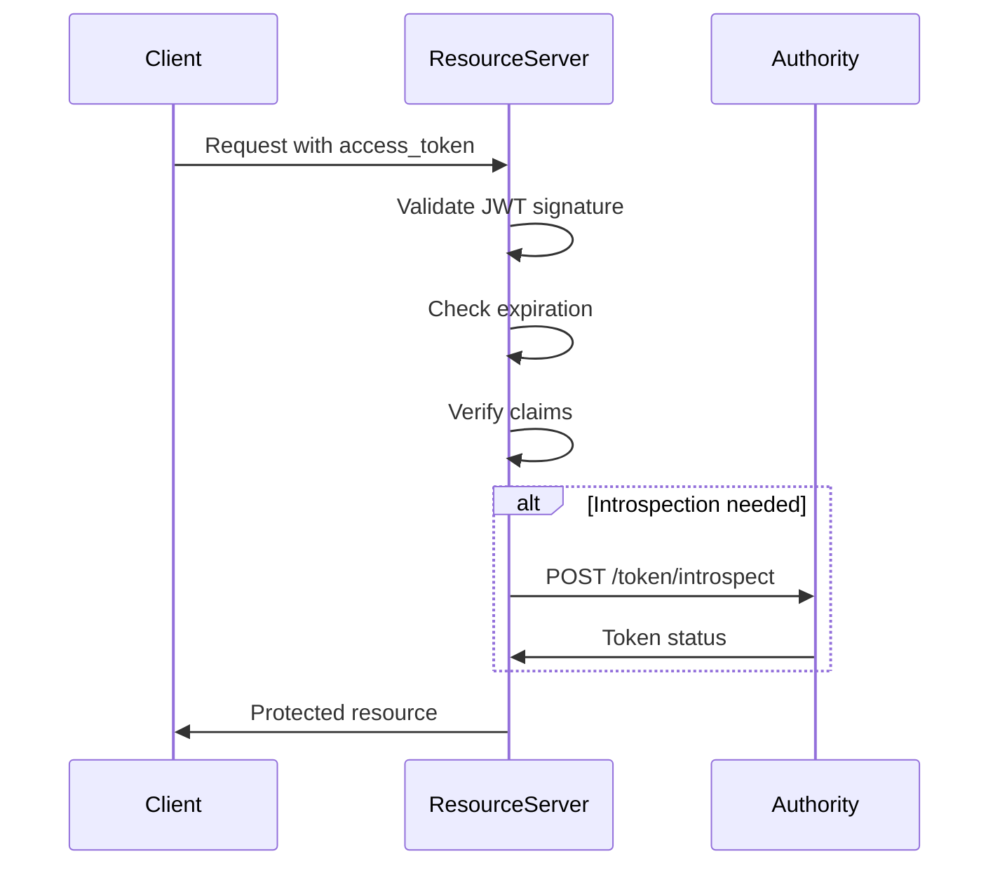
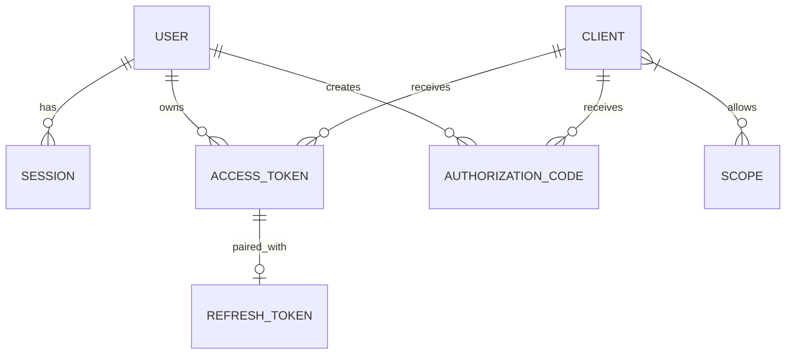

# Architecture

Understanding how Authority is built and organized.

## System Overview



## Component Architecture

### Endpoints Layer

The endpoints layer handles HTTP requests and responses:

- **OAuth Endpoints** - Authorization, token, introspection, revocation
- **OIDC Endpoints** - UserInfo, discovery, JWKS
- **Admin Endpoints** - Client, user, scope management
- **Auth Endpoints** - Login, logout, password reset

### Services Layer

Business logic is encapsulated in services:

| Service | Responsibility |
|---------|----------------|
| **AuthenticationService** | User authentication, MFA validation |
| **TokenService** | Token generation, validation, revocation |
| **UserService** | User CRUD, password management |
| **ClientService** | OAuth client management |
| **SessionService** | Session creation, validation, cleanup |
| **AuditService** | Event logging, compliance |

### Data Layer

Data access and persistence:

- **Models** - Data structures (User, Client, Token, etc.)
- **Repositories** - Database queries
- **Migrations** - Schema management

## Request Flow

### Authorization Code Flow



### Token Validation Flow



## Data Model

### Core Entities



### User

```
users
├── id (UUID)
├── email (unique)
├── password_hash
├── name
├── mfa_secret
├── mfa_enabled
├── locked
├── locked_at
├── failed_attempts
├── role
├── created_at
└── updated_at
```

### Client

```
clients
├── id (UUID)
├── client_id (unique)
├── client_secret_hash
├── name
├── redirect_uris (array)
├── grant_types (array)
├── scopes (array)
├── client_type
├── created_at
└── updated_at
```

## Security Architecture

### Defense in Depth

```
┌─────────────────────────────────────┐
│           Rate Limiting              │
├─────────────────────────────────────┤
│          Input Validation            │
├─────────────────────────────────────┤
│         Authentication               │
├─────────────────────────────────────┤
│         Authorization                │
├─────────────────────────────────────┤
│         Business Logic               │
├─────────────────────────────────────┤
│         Data Validation              │
├─────────────────────────────────────┤
│         Audit Logging                │
└─────────────────────────────────────┘
```

### Token Security

1. **Signing** - JWTs signed with RS256
2. **Rotation** - Refresh tokens rotated on use
3. **Revocation** - Tokens can be invalidated
4. **Expiration** - Short-lived access tokens

## Scalability

### Horizontal Scaling

Authority supports multiple instances:

```
                    ┌─────────────┐
                    │   Load      │
                    │  Balancer   │
                    └──────┬──────┘
            ┌──────────────┼──────────────┐
      ┌─────┴─────┐  ┌─────┴─────┐  ┌─────┴─────┐
      │ Authority │  │ Authority │  │ Authority │
      │ Instance  │  │ Instance  │  │ Instance  │
      └─────┬─────┘  └─────┬─────┘  └─────┬─────┘
            └──────────────┼──────────────┘
                    ┌──────┴──────┐
      ┌─────────────┴─────────────┴─────────────┐
      │              PostgreSQL                   │
      │              (Primary)                    │
      └─────────────┬─────────────┬─────────────┘
                    │             │
              ┌─────┴─────┐ ┌─────┴─────┐
              │  Replica  │ │  Replica  │
              └───────────┘ └───────────┘
```

### Redis for State

Shared state stored in Redis:

- User sessions
- Rate limit counters
- Token cache (optional)

## Technology Stack

| Layer | Technology |
|-------|------------|
| Language | Crystal |
| Web Framework | Azu |
| Database | PostgreSQL |
| Cache | Redis |
| Templates | Crinja (Jinja2) |
| JWT | crystal-jwt |

## Next Steps

- [Security Model](security-model.md) - Security architecture
- [Token Lifecycle](token-lifecycle.md) - Token management
- [OAuth 2.0 Concepts](oauth2-concepts.md) - Protocol fundamentals
