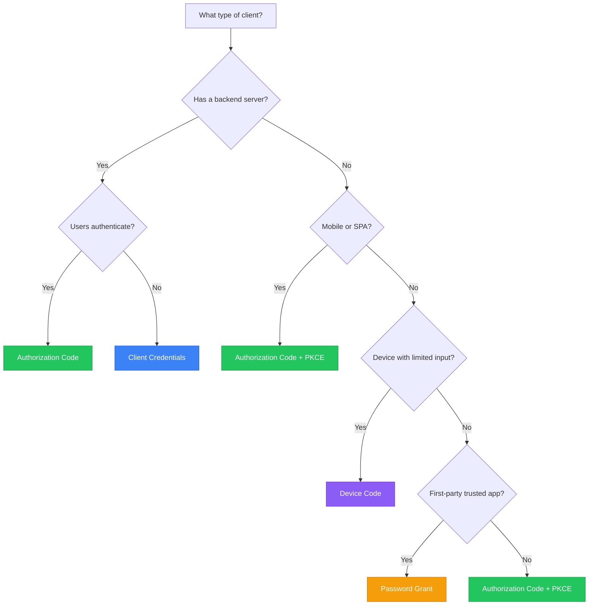

# Choosing Grant Types

A guide to selecting the right OAuth 2.0 grant type for your application.

## Decision Flowchart



## Quick Reference

| Scenario | Grant Type | Security |
|----------|------------|----------|
| Web app with backend | Authorization Code | High |
| Single-page application | Authorization Code + PKCE | High |
| Mobile application | Authorization Code + PKCE | High |
| Server-to-server | Client Credentials | High |
| CLI tool | Device Code | Medium |
| Smart TV / IoT | Device Code | Medium |
| First-party mobile app | Password (with caution) | Medium |

## Authorization Code

### When to Use

- Web applications with server-side code
- You can securely store a client secret
- Users need to authenticate

### How It Works

```
User → Your App → Authority → User authenticates → Your Backend → Tokens
```

The backend exchanges the code for tokens, keeping secrets secure.

### Example Scenarios

- Traditional web applications (Rails, Django, Express)
- Server-rendered applications
- Applications with session-based auth

### Considerations

- Requires backend infrastructure
- Client secret must be protected
- Full OAuth security guarantees

## Authorization Code + PKCE

### When to Use

- Single-page applications (React, Vue, Angular)
- Mobile applications (iOS, Android)
- Desktop applications
- Any public client (cannot keep secrets)

### How It Works

```
Client generates: code_verifier (random)
Client sends: code_challenge = SHA256(code_verifier)
Authority returns: authorization code
Client proves: code_verifier
Authority validates: SHA256(code_verifier) == code_challenge
Authority issues: tokens
```

### Example Scenarios

- React/Vue/Angular SPAs
- React Native / Flutter apps
- Electron desktop apps
- Browser extensions

### Considerations

- No client secret required
- Proof of possession via PKCE
- Recommended for all new public clients

## Client Credentials

### When to Use

- Backend services calling APIs
- Microservice communication
- Scheduled jobs / cron tasks
- No user context needed

### How It Works

```
Your Service → Authority (client_id + secret) → Token → Your Service → API
```

### Example Scenarios

- Payment processing service
- Data synchronization jobs
- Inter-service authentication
- API integrations

### Considerations

- No user involved
- No refresh tokens (just request new token)
- Client must protect its credentials
- Scopes limited to service-level access

## Device Code

### When to Use

- Devices without browsers
- Limited input capability
- Smart TVs, game consoles
- CLI applications

### How It Works

```
Device → Authority: Request device code
Authority → Device: device_code + user_code + URL
Device → User: "Visit URL, enter code"
User → Browser → Authority: Enter code, authenticate
Device → Authority: Poll for token
Authority → Device: Access token
```

### Example Scenarios

- Smart TV streaming apps
- Game console apps
- CLI tools (gh, aws-cli style)
- IoT devices
- Printers / picture frames

### Considerations

- User must have secondary device
- Requires polling mechanism
- Codes expire (typically 5-15 minutes)
- Good UX requires clear instructions

## Password Grant (Legacy)

### When to Use


Only for first-party, trusted applications where other grants are not feasible.


- Migrating from legacy systems
- Highly trusted first-party apps
- When redirect flow is impossible

### How It Works

```
App → User: Enter credentials
App → Authority: username + password
Authority → App: Tokens
```

### Considerations

- User enters password in your app
- App sees user's credentials
- No consent flow
- MFA may be bypassed
- **Never for third-party apps**

## Grant Type Comparison

### Security

| Grant | Secret Protection | Token Exposure | Phishing Risk |
|-------|-------------------|----------------|---------------|
| Auth Code | High | Low | Low |
| Auth Code + PKCE | Medium | Low | Low |
| Client Credentials | High | N/A | N/A |
| Device Code | Medium | Low | Medium |
| Password | Low | Medium | High |

### User Experience

| Grant | User Steps | Complexity | Best For |
|-------|------------|------------|----------|
| Auth Code | Login + Consent | Medium | Web apps |
| Auth Code + PKCE | Login + Consent | Medium | Mobile/SPA |
| Client Credentials | None | Low | Services |
| Device Code | Visit URL + Enter code | High | Limited input |
| Password | Enter credentials | Low | Legacy |

## Migration Paths

### From Password to PKCE

1. Add PKCE support to your app
2. Implement authorization flow
3. Migrate users gradually
4. Disable password grant

### From Implicit to PKCE

1. Add PKCE code exchange
2. Update authorization request (`response_type=code`)
3. Handle code callback
4. Remove fragment token handling

## Common Mistakes

### Using Implicit Grant

**Don't:** Use implicit for new applications
**Do:** Use Authorization Code + PKCE

### Password Grant for Third-Party Apps

**Don't:** Let third-party apps collect passwords
**Do:** Use authorization flow with consent

### No PKCE for Public Clients

**Don't:** Use auth code without PKCE in SPAs/mobile
**Do:** Always use PKCE for public clients

### Long-Lived Tokens Without Refresh

**Don't:** Issue 24-hour access tokens without refresh
**Do:** Short access tokens + refresh tokens

## Next Steps

- [OAuth 2.0 Concepts](oauth2-concepts.md) - Protocol fundamentals
- [Security Model](security-model.md) - Security considerations
- [Authorization Code Reference](../reference/oauth2/authorization-code.md) - Implementation details
