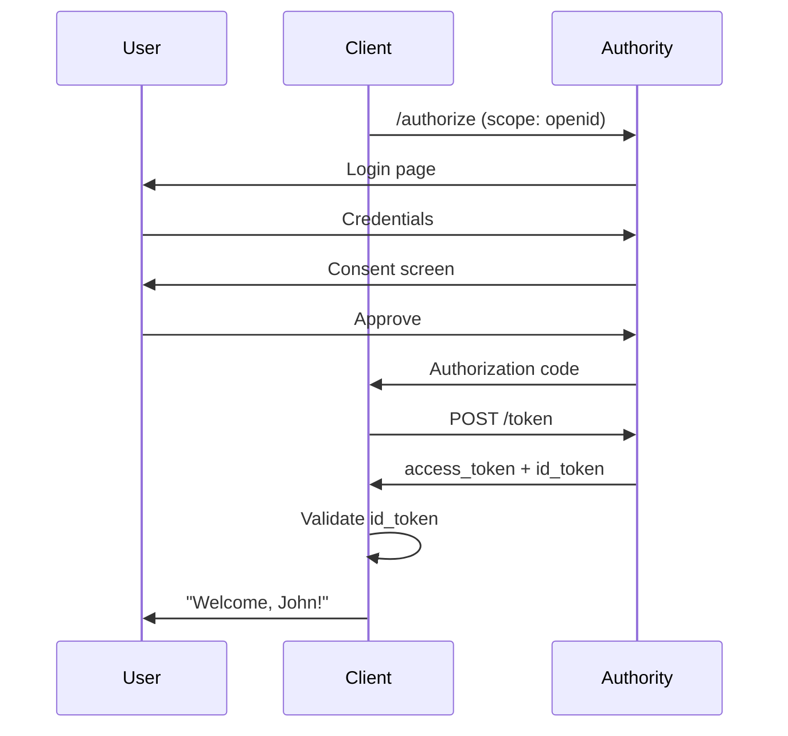

# OpenID Connect Concepts

Understanding identity and authentication with OpenID Connect.

## OAuth vs OpenID Connect

| Aspect | OAuth 2.0 | OpenID Connect |
|--------|-----------|----------------|
| Purpose | Authorization | Authentication |
| Question | "What can they do?" | "Who are they?" |
| Result | Access token | ID token + Access token |
| Use case | API access | User login |

OpenID Connect (OIDC) is a **thin layer on top of OAuth 2.0** that adds identity.

## The Identity Layer

```
┌────────────────────────────────────────┐
│           OpenID Connect               │
│         (Authentication)               │
├────────────────────────────────────────┤
│              OAuth 2.0                 │
│          (Authorization)               │
└────────────────────────────────────────┘
```

OIDC adds:

- **ID Token** - Proof of authentication
- **UserInfo Endpoint** - User profile data
- **Standard Scopes** - `openid`, `profile`, `email`
- **Discovery** - Automatic configuration

## The ID Token

The ID token is a JWT that proves authentication:

```json
{
  "iss": "https://auth.example.com",
  "sub": "user-123",
  "aud": "client-abc",
  "exp": 1699999999,
  "iat": 1699996399,
  "auth_time": 1699996300,
  "nonce": "abc123",
  "name": "John Doe",
  "email": "john@example.com"
}
```

### Key Claims

| Claim | Description |
|-------|-------------|
| `iss` | Who issued the token |
| `sub` | Unique user identifier |
| `aud` | Who the token is for |
| `exp` | When it expires |
| `iat` | When it was issued |
| `auth_time` | When user authenticated |
| `nonce` | Prevents replay attacks |

## Standard Scopes

Request identity information with scopes:

```
scope=openid profile email
```

| Scope | Claims |
|-------|--------|
| `openid` | `sub` (required) |
| `profile` | `name`, `picture`, etc. |
| `email` | `email`, `email_verified` |
| `address` | `address` |
| `phone` | `phone_number` |

## Authentication Flow



## ID Token vs Access Token

| Aspect | ID Token | Access Token |
|--------|----------|--------------|
| For | Client | Resource Server |
| Purpose | Prove identity | Authorize API calls |
| Validate | At login | On each request |
| Contains | User identity | Authorization grants |

### When to Use Which

```
ID Token: "This is John, authenticated 5 minutes ago"
           → Use for login decisions

Access Token: "John has read access to documents"
              → Use for API authorization
```

## UserInfo Endpoint

Get more user data with the access token:

```bash
GET /userinfo
Authorization: Bearer access_token
```

Response:
```json
{
  "sub": "user-123",
  "name": "John Doe",
  "given_name": "John",
  "family_name": "Doe",
  "email": "john@example.com",
  "picture": "https://..."
}
```

### ID Token vs UserInfo

| Aspect | ID Token | UserInfo |
|--------|----------|----------|
| When | Token response | Separate request |
| Format | JWT (signed) | JSON |
| Freshness | Point-in-time | Current values |

Use ID token for authentication proof. Use UserInfo for current profile data.

## Discovery

OIDC providers publish configuration:

```bash
GET /.well-known/openid-configuration
```

Response:
```json
{
  "issuer": "https://auth.example.com",
  "authorization_endpoint": "https://auth.example.com/authorize",
  "token_endpoint": "https://auth.example.com/token",
  "userinfo_endpoint": "https://auth.example.com/userinfo",
  "jwks_uri": "https://auth.example.com/.well-known/jwks.json"
}
```

Clients use discovery to automatically configure themselves.

## Nonce

Prevents token replay attacks:

1. Client generates random nonce
2. Client sends nonce in authorization request
3. Authority includes nonce in ID token
4. Client verifies nonce matches

## Authentication Patterns

### Simple Login

```
User clicks "Login" → Redirect to Authority → User logs in →
Redirect back with tokens → User is logged in
```

### Single Sign-On (SSO)

```
User logged into Authority → Visits App A → Already authenticated →
Visits App B → Already authenticated (no re-login)
```

### Silent Authentication

```
Client → Authority (prompt=none) →
If logged in: Return tokens
If not: Return error
```

## Security Considerations

### Validate ID Tokens

Always validate:

1. **Signature** - Using JWKS
2. **Issuer** - Matches expected
3. **Audience** - Contains your client ID
4. **Expiration** - Not expired
5. **Nonce** - If used, matches sent value

### Don't Trust Claims Blindly

- ID tokens are signed, not encrypted
- Claims can be read by anyone
- Don't put sensitive data in ID tokens

### Use ID Token for Authentication Only

- ID tokens prove identity at login time
- Don't use ID tokens for API authorization
- Use access tokens for API calls

## Next Steps

- [OAuth 2.0 Concepts](oauth2-concepts.md) - Authorization fundamentals
- [Token Lifecycle](token-lifecycle.md) - Token management
- [ID Tokens Reference](../reference/openid-connect/id-tokens.md) - Technical details
