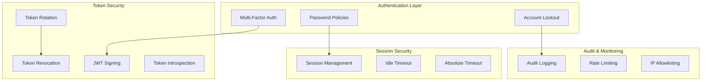

# Security Model

Understanding Authority's security architecture and design principles.

## Security Architecture



## Defense in Depth

Authority implements multiple security layers:

```
┌─────────────────────────────────────────┐
│        Network Security (HTTPS)          │
├─────────────────────────────────────────┤
│           Rate Limiting                  │
├─────────────────────────────────────────┤
│         Input Validation                 │
├─────────────────────────────────────────┤
│   Authentication (Password + MFA)        │
├─────────────────────────────────────────┤
│       Session Management                 │
├─────────────────────────────────────────┤
│     Authorization (Scopes)               │
├─────────────────────────────────────────┤
│         Audit Logging                    │
└─────────────────────────────────────────┘
```

## Authentication Security

### Password Security

Passwords are:

1. **Hashed** - Using bcrypt with cost factor 12
2. **Salted** - Unique salt per password
3. **Validated** - Against policy requirements
4. **History-checked** - Prevent reuse

### Multi-Factor Authentication

TOTP-based MFA provides:

- **Something you know** - Password
- **Something you have** - Authenticator app

MFA protects against:
- Credential stuffing
- Phishing
- Password breaches

### Account Lockout

Progressive lockout:

```
Attempt 1-4:   Normal login
Attempt 5:     Account locked (30 min)
Attempt 6+:    Lock timer resets
```

Protects against brute-force attacks while limiting denial-of-service impact.

## Token Security

### JWT Signing

Tokens are signed with RS256:

- **Private key** - Signs tokens (server only)
- **Public key** - Verifies tokens (anyone)
- **Key rotation** - Periodic key changes

### Token Lifetimes

| Token | Lifetime | Purpose |
|-------|----------|---------|
| Authorization Code | 10 minutes | Minimize interception window |
| Access Token | 1 hour | Limit exposure if stolen |
| Refresh Token | 30 days | User convenience |
| ID Token | 1 hour | Authentication proof |

### Token Rotation

Refresh tokens rotate on use:

```
Request with Refresh Token A
↓
Issue new Access Token
Issue new Refresh Token B
Invalidate Refresh Token A
```

If a refresh token is stolen, the attacker races with the legitimate client.

### Token Revocation

Tokens can be revoked:

- User logout
- Password change
- Admin action
- Security concern

## Session Security

### Session Binding

Sessions are bound to:

- User agent
- IP address (optional)
- Expiration time

### Session Limits

- **Absolute timeout** - Maximum session lifetime
- **Idle timeout** - Inactivity limit
- **Single session** - One active session per user (optional)

## OAuth Security

### Redirect URI Validation

- Exact match required
- No wildcards
- HTTPS in production
- Pre-registered only

### State Parameter

Prevents CSRF:

```
Client generates: state=abc123
Client sends in request
Authority returns: state=abc123
Client verifies match
```

### PKCE

Protects public clients:

```
code_verifier = random()
code_challenge = SHA256(code_verifier)

Authorization: Send code_challenge
Token exchange: Prove with code_verifier
```

## Data Protection

### Sensitive Data

| Data | Storage | Access |
|------|---------|--------|
| Passwords | Hashed (bcrypt) | Never retrievable |
| MFA secrets | Encrypted | User + admin |
| Client secrets | Hashed | Never retrievable |
| Tokens | Database + cache | Service only |

### Database Security

- Connection encryption (SSL)
- Prepared statements (SQL injection prevention)
- Principle of least privilege
- Regular backups

## Audit and Compliance

### Logged Events

- Authentication attempts (success/failure)
- Token operations (issue/revoke)
- Admin actions
- Configuration changes

### Log Contents

Each log entry includes:

- Timestamp
- Actor (user/client/system)
- Action
- Resource
- IP address
- User agent
- Changes made

### Retention

- Default: 90 days
- Configurable per compliance requirements
- Export for external systems

## Threat Mitigation

| Threat | Mitigation |
|--------|------------|
| Credential stuffing | Lockout, MFA, rate limiting |
| Token theft | Short lifetimes, rotation, binding |
| CSRF | State parameter, SameSite cookies |
| Code interception | PKCE, short code lifetime |
| Replay attacks | Nonce, one-time codes |
| Brute force | Lockout, progressive delay |

## Best Practices

### Deployment

1. **Always use HTTPS** - No exceptions
2. **Use strong secrets** - Cryptographically random
3. **Enable MFA** - At least for admins
4. **Monitor logs** - Regular review
5. **Keep updated** - Apply security patches

### Client Implementation

1. **Validate tokens** - Always verify signatures
2. **Use PKCE** - For all public clients
3. **Store securely** - No localStorage for sensitive tokens
4. **Handle errors** - Don't leak information
5. **Implement logout** - Revoke tokens properly

## Next Steps

- [Token Lifecycle](token-lifecycle.md) - Token management details
- [Architecture](architecture.md) - System design
- [Enable MFA](../how-to/security/enable-mfa.md) - MFA setup guide
