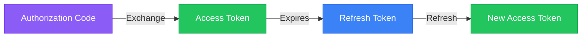
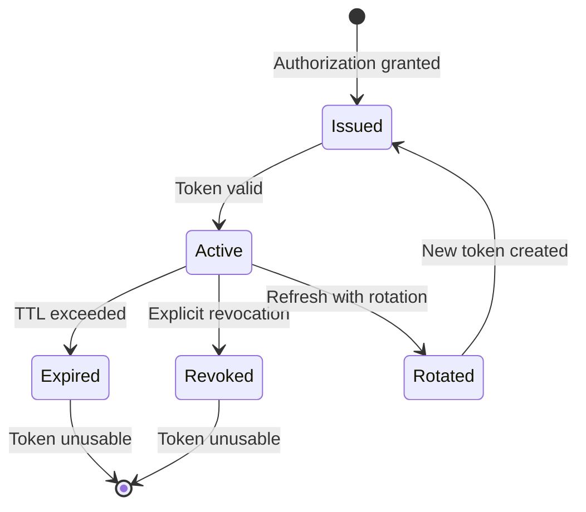

# Token Lifecycle

Understanding how tokens are created, used, and retired in Authority.

## Token Types Overview



## Token States



## Authorization Code

### Purpose

Short-lived code exchanged for tokens. Separates user authentication from token issuance.

### Lifecycle

```
Creation:  User approves consent
Lifetime:  10 minutes (configurable)
Exchange:  POST /token (one-time use)
Deletion:  After exchange or expiration
```

### Security Properties

- **One-time use** - Cannot be reused
- **Short-lived** - Minimizes interception window
- **Client-bound** - Tied to specific client
- **PKCE-protected** - Proof of possession (public clients)

## Access Token

### Purpose

Authorizes API requests. Presented to resource servers.

### Lifecycle

```
Creation:  Token endpoint (code exchange or refresh)
Lifetime:  1 hour (configurable)
Usage:     Bearer token in API requests
Expiration: Rejected after TTL
```

### Format

Authority issues JWTs:

```json
{
  "iss": "https://auth.example.com",
  "sub": "user-123",
  "aud": "client-abc",
  "exp": 1699999999,
  "scope": "read write"
}
```

### Validation

Resource servers validate by:

1. Verifying JWT signature (JWKS)
2. Checking expiration
3. Verifying issuer and audience
4. Checking required scopes

## Refresh Token

### Purpose

Obtains new access tokens without user interaction.

### Lifecycle

```
Creation:  Token endpoint (with offline_access scope)
Lifetime:  30 days (configurable)
Usage:     POST /token with grant_type=refresh_token
Rotation:  New refresh token on each use
```

### Rotation

With rotation enabled:

```
Time T:   Client has Refresh Token A
Time T+1: Client uses Refresh Token A
          ↓
          New Access Token issued
          New Refresh Token B issued
          Refresh Token A invalidated

Time T+2: Attacker tries Refresh Token A
          ↓
          Rejected (already used)
          Alert: Possible token theft
```

### Grace Period

Optional reuse window for concurrent requests:

```
Refresh Token A used at T
Refresh Token A still valid for 2 seconds
After 2 seconds: Only Refresh Token B valid
```

## ID Token

### Purpose

Proves user authentication. Contains identity claims.

### Lifecycle

```
Creation:  Token endpoint (with openid scope)
Lifetime:  1 hour (typically)
Usage:     Validate at login time
Storage:   Client-side (for user info display)
```

### Validation

Must validate:

1. Signature (JWKS)
2. Issuer matches expected
3. Audience contains client ID
4. Expiration not passed
5. Nonce matches (if sent)

## Token Revocation

### Triggers

Tokens are revoked when:

- User logs out
- User changes password
- Admin revokes manually
- Security incident detected
- Session ends

### Cascade

```
Session Revoked
├── Access Tokens invalidated
└── Refresh Tokens invalidated
```

### Revocation Check

For real-time validation:

```
POST /token/introspect
↓
{
  "active": false  // Token revoked
}
```

## Token Storage

### Server-Side

```
┌─────────────────────────────────────────┐
│            PostgreSQL                    │
│  ┌─────────┐ ┌─────────┐ ┌─────────┐   │
│  │ Access  │ │ Refresh │ │  Auth   │   │
│  │ Tokens  │ │ Tokens  │ │  Codes  │   │
│  └─────────┘ └─────────┘ └─────────┘   │
└─────────────────────────────────────────┘

┌─────────────────────────────────────────┐
│              Redis                       │
│  ┌─────────────────────────────────┐    │
│  │   Token Cache (optional)         │    │
│  │   Session Storage                │    │
│  └─────────────────────────────────┘    │
└─────────────────────────────────────────┘
```

### Client-Side

| Token | Storage | Notes |
|-------|---------|-------|
| Access | Memory | Clear on logout |
| Refresh | Secure cookie | httpOnly, secure |
| ID | Memory | User info display |

## Best Practices

### Token Lifetimes

| Environment | Access Token | Refresh Token |
|-------------|--------------|---------------|
| High Security | 15 minutes | 1 day |
| Standard | 1 hour | 30 days |
| User-Friendly | 1 day | 90 days |

### Refresh Strategy

**Proactive:**
```javascript
// Refresh 5 minutes before expiry
scheduleRefresh(expiresIn - 300);
```

**Reactive:**
```javascript
// Refresh on 401 response
if (response.status === 401) {
  await refresh();
  retry();
}
```

### Handling Expiration

```javascript
async function apiCall(endpoint) {
  // Check token validity
  if (isExpired(accessToken)) {
    accessToken = await refresh();
  }

  return fetch(endpoint, {
    headers: { Authorization: `Bearer ${accessToken}` }
  });
}
```

## Next Steps

- [Security Model](security-model.md) - Security architecture
- [Refresh Tokens Reference](../reference/oauth2/refresh-tokens.md) - Technical details
- [Token Settings](../reference/configuration/token-settings.md) - Configuration
