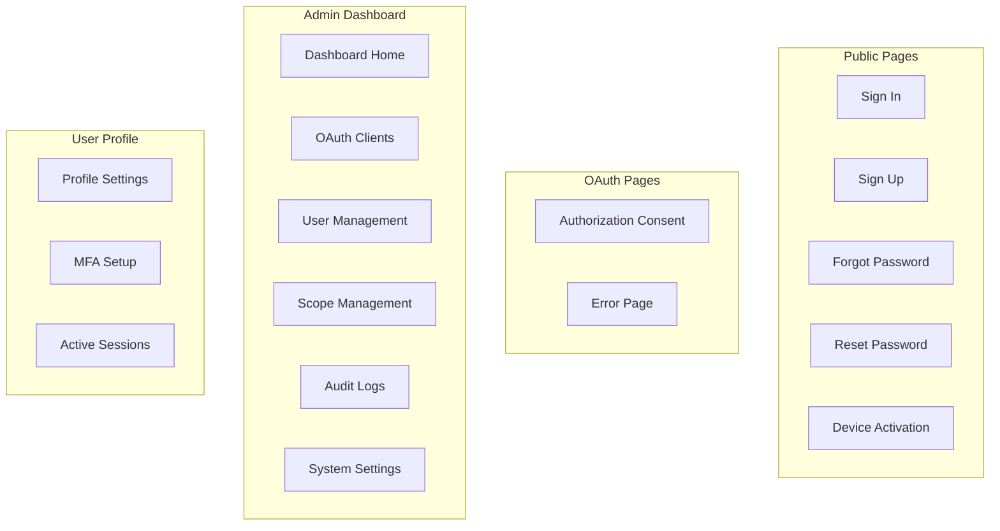

# Customize UI Templates

Modify Authority's appearance with Jinja templates.

## Overview

Authority uses Crinja (Jinja2-compatible) templates for all pages:

- Login / Registration
- OAuth consent
- Password reset
- Admin dashboard
- User profile

## Template Structure

```
public/
├── templates/
│   ├── layout.html          # Base layout
│   ├── signin.html          # Login page
│   ├── signup.html          # Registration
│   ├── authorize.html       # OAuth consent
│   ├── activate.html        # Device activation
│   ├── forgot-password.html # Password reset request
│   ├── reset-password.html  # Password reset form
│   ├── errors.html          # Error messages
│   └── emails/              # Email templates
│       ├── verification.html
│       ├── password-reset.html
│       └── welcome.html
├── css/
│   └── styles.css           # Main stylesheet
└── js/
    └── app.js               # Client JavaScript
```

## UI Components



## Template Syntax

### Variables

```html
<h1>Welcome, {{ user.name }}</h1>
<p>Email: {{ user.email }}</p>
```

### Conditionals

```html

<div class="alert alert-error">{{ error }}</div>



<span class="badge">MFA Enabled</span>

```

### Loops

```html
<ul class="scopes">

  <li>{{ scope.name }}: {{ scope.description }}</li>

</ul>
```

### Template Inheritance

Base layout (`layout.html`):

```html
<!DOCTYPE html>
<html>
<head>
  <title>Authority</title>
  <link rel="stylesheet" href="/css/styles.css">
</head>
<body>
  
  <script src="/js/app.js"></script>
</body>
</html>
```

Page template (`signin.html`):

```html




<main class="login-form">
  
  <form action="/signin" method="post">
    <input type="text" name="username" placeholder="Username" required>
    <input type="password" name="password" placeholder="Password" required>
    <button type="submit">Sign In</button>
  </form>
</main>

```

## Available Variables

### Sign In Page

| Variable | Description |
|----------|-------------|
| `forward_url` | Redirect URL after login |
| `error` | Error message |
| `username` | Previously entered username |

### Authorization Page

| Variable | Description |
|----------|-------------|
| `client_name` | OAuth client name |
| `client_id` | Client identifier |
| `scopes` | Requested scopes |
| `redirect_uri` | Callback URL |
| `state` | CSRF state parameter |

### Device Activation

| Variable | Description |
|----------|-------------|
| `user_code` | Pre-filled code |
| `audience` | Client name |
| `error` | Error message |

## Styling

### CSS Variables

```css
:root {
  /* Primary colors */
  --primary-color: #7c3aed;
  --primary-hover: #6d28d9;

  /* Background colors */
  --bg-primary: #0f172a;
  --bg-secondary: #1e293b;
  --bg-card: #1e293b;

  /* Text colors */
  --text-primary: #f8fafc;
  --text-secondary: #94a3b8;

  /* Status colors */
  --success: #22c55e;
  --warning: #f59e0b;
  --error: #ef4444;

  /* Border radius */
  --radius-sm: 0.375rem;
  --radius-md: 0.5rem;
  --radius-lg: 0.75rem;
}
```

### Custom Theme

Create a custom theme:

```css
/* Light theme */
.theme-light {
  --bg-primary: #ffffff;
  --bg-secondary: #f1f5f9;
  --text-primary: #0f172a;
  --text-secondary: #64748b;
}
```

## Screenshots

### Landing Page


### Sign In


### Admin Dashboard


## Configuration

### Custom Template Path

```bash
TEMPLATES_PATH=/path/to/custom/templates
```

### Reload Templates

In development, templates reload automatically. In production:

```bash
# Restart server to reload templates
docker-compose restart authority
```

## Best Practices


**Do:**

- Keep custom templates in version control
- Test on multiple screen sizes
- Maintain accessibility (ARIA, contrast)
- Preserve security features (CSRF tokens)



**Avoid:**

- Removing hidden form fields
- Modifying form action URLs
- Disabling client-side validation
- Adding inline JavaScript


## Next Steps

- [Email Templates](email-templates.md) - Customize emails
- [Branding](branding.md) - Logo and colors
- [User Interface Reference](../../development/user-interface.md) - Full reference
