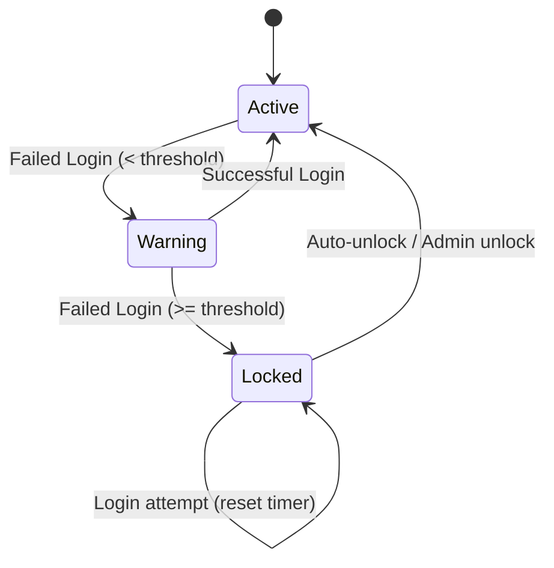

# Configure Account Lockout

Protect against brute-force attacks with account lockout.

## How It Works

After a configured number of failed login attempts, the account is temporarily locked:



## Configuration

### Environment Variables

| Variable | Default | Description |
|----------|---------|-------------|
| `LOCKOUT_THRESHOLD` | `5` | Failed attempts before lockout |
| `LOCKOUT_DURATION` | `30` | Lockout duration (minutes) |
| `ENABLE_AUTO_UNLOCK` | `true` | Auto-unlock after duration |

### Example Configuration

```bash
# Lock after 5 failed attempts
LOCKOUT_THRESHOLD=5

# Lock for 30 minutes
LOCKOUT_DURATION=30

# Auto-unlock enabled
ENABLE_AUTO_UNLOCK=true
```

## Progressive Lockout

For enhanced security, increase lockout duration with each lockout:

```bash
# First lockout: 15 minutes
# Second lockout: 30 minutes
# Third lockout: 60 minutes
# Fourth+: 120 minutes
PROGRESSIVE_LOCKOUT=true
```

## Admin Dashboard

### View Locked Accounts

1. Navigate to **Admin Dashboard** → **Users**
2. Filter by **Status: Locked**

### Unlock an Account

1. Select the locked user
2. Click **Unlock Account**
3. Optionally, send password reset email


## Monitoring

### Audit Log Events

Lockout events are logged:

| Event | Description |
|-------|-------------|
| `user.login_failed` | Failed login attempt |
| `user.locked` | Account locked |
| `user.unlocked` | Account unlocked (auto or manual) |

### Alerts

Set up alerts for lockout events:

```bash
# Example: Send alert on multiple lockouts
grep "user.locked" /var/log/authority/audit.log | alert-script
```

## API Integration

### Check Lock Status

```bash
GET /api/users/{id}
Authorization: Bearer {admin_token}
```

Response:
```json
{
  "id": "user-uuid",
  "email": "user@example.com",
  "locked": true,
  "locked_at": "2024-01-15T10:30:00Z",
  "failed_attempts": 5,
  "unlock_at": "2024-01-15T11:00:00Z"
}
```

### Unlock User

```bash
POST /api/users/{id}/unlock
Authorization: Bearer {admin_token}
```

## IP-Based Lockout

Optionally lock by IP address instead of account:

```bash
LOCKOUT_BY_IP=true
IP_LOCKOUT_THRESHOLD=10
```

This helps when attackers try multiple usernames from the same IP.

## Whitelist

Exclude certain IPs from lockout:

```bash
LOCKOUT_WHITELIST=192.168.1.0/24,10.0.0.0/8
```

## User Experience

### Locked Account Message

Users see a clear message when locked:

```
Your account has been temporarily locked due to multiple failed login attempts.
Please try again in 30 minutes or contact support.
```

### Reset Password Option

Offer password reset as an alternative:

```
Forgot your password? [Reset Password]
```

## Best Practices


**Recommended settings for most deployments:**

- Threshold: 5 attempts
- Duration: 30 minutes
- Auto-unlock: Enabled
- Progressive lockout: Enabled



**Avoid:**

- Very low thresholds (< 3) - frustrates legitimate users
- Very long durations (> 24 hours) - enables denial of service
- Permanent lockout - requires manual intervention


## Troubleshooting

### Users getting locked frequently

- Check for password manager issues
- Verify caps lock behavior
- Consider increasing threshold

### Lockout not working

- Verify environment variables are loaded
- Check `ENABLE_LOCKOUT` is not set to `false`
- Review audit logs for failed attempts

### Auto-unlock not happening

- Verify `ENABLE_AUTO_UNLOCK=true`
- Check server time synchronization
- Review logs for errors

## Next Steps

- [Enable MFA](enable-mfa.md) - Multi-factor authentication
- [Password Policies](password-policies.md) - Password requirements
- [Audit Logging](audit-logging.md) - Track security events
