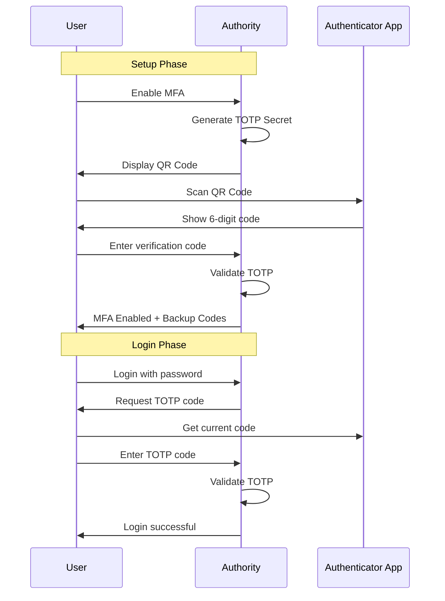

# Enable Multi-Factor Authentication

Set up TOTP-based two-factor authentication for Authority users.

## Overview

Authority supports Time-based One-Time Passwords (TOTP) for MFA. Users can use apps like:

- Google Authenticator
- Authy
- 1Password
- Microsoft Authenticator

## MFA Flow



## User Setup

### Step 1: Navigate to Profile

1. Log in to Authority
2. Click your profile name
3. Select **Security Settings**

### Step 2: Enable MFA

1. Click **Enable Two-Factor Authentication**
2. Authority displays a QR code


### Step 3: Scan QR Code

1. Open your authenticator app
2. Tap **Add Account** or **+**
3. Scan the QR code

### Step 4: Verify Setup

1. Enter the 6-digit code from your app
2. Click **Verify**
3. Save your backup codes in a secure location

## Backup Codes

When MFA is enabled, Authority generates 10 one-time backup codes. Store these securely - they can be used if you lose access to your authenticator app.

Example backup codes:
```
abc12-def34
ghi56-jkl78
mno90-pqr12
...
```

Each code can only be used once.

## Admin Configuration

### Require MFA for Admins

Enforce MFA for all administrator accounts:

```bash
REQUIRE_ADMIN_MFA=true
```

### Require MFA for All Users

Force MFA enrollment for all users:

```bash
REQUIRE_MFA=true
```

### MFA Grace Period

Allow users time to set up MFA:

```bash
MFA_GRACE_PERIOD_DAYS=7
```

## Disabling MFA

### User Self-Service

Users can disable MFA from their profile if allowed:

1. Navigate to **Security Settings**
2. Click **Disable Two-Factor Authentication**
3. Enter current TOTP code to confirm

### Admin Override

Administrators can disable MFA for users:

1. Go to **Admin Dashboard** → **Users**
2. Select the user
3. Click **Disable MFA**

This is useful when a user loses access to their authenticator.

## API Integration

### Check MFA Status

```bash
GET /api/users/{id}
Authorization: Bearer {admin_token}
```

Response:
```json
{
  "id": "user-uuid",
  "email": "user@example.com",
  "mfa_enabled": true,
  "mfa_configured_at": "2024-01-15T10:30:00Z"
}
```

### Require MFA in Authorization

During OAuth authorization, check if MFA is required:

```javascript
// After successful password authentication
if (user.mfa_enabled) {
  // Show TOTP input form
  showMFAPrompt();
} else if (settings.require_mfa) {
  // Redirect to MFA setup
  redirectToMFASetup();
}
```

## Recovery

### Lost Authenticator

If a user loses their phone:

1. Use a backup code to log in
2. Disable MFA
3. Set up MFA again with new device

### Lost Backup Codes

If a user loses both authenticator and backup codes:

1. Admin disables MFA for the user
2. User logs in with password only
3. User sets up MFA again
4. User saves new backup codes

## Security Considerations


- Backup codes should be stored securely (password manager, safe)
- Regenerate backup codes periodically
- Monitor audit logs for MFA disable events


## Troubleshooting

### Invalid TOTP Code

- Verify device time is synchronized
- Ensure you're using the correct account in the authenticator
- Wait for the next code cycle (30 seconds)

### QR Code Won't Scan

- Use the manual entry option
- Enter the secret key directly into your authenticator

### Locked Out

- Use a backup code
- Contact administrator to disable MFA

## Next Steps

- [Account Lockout](configure-lockout.md) - Brute-force protection
- [Password Policies](password-policies.md) - Password requirements
- [Audit Logging](audit-logging.md) - Track security events
