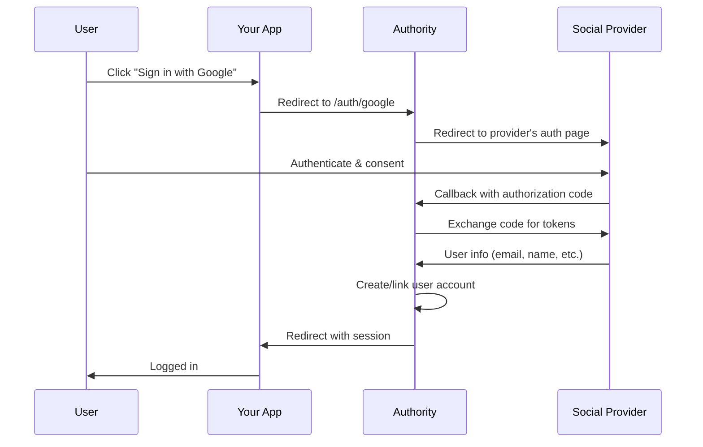

# Social Login

Configure social authentication providers to allow users to sign in with their existing accounts from Google, GitHub, Facebook, LinkedIn, and Apple.

## Available Guides

- [Configure Google](configure-google.md) - Enable Google Sign-In
- [Configure GitHub](configure-github.md) - Enable GitHub authentication
- [Configure Facebook](configure-facebook.md) - Enable Facebook Login
- [Configure LinkedIn](configure-linkedin.md) - Enable LinkedIn Sign-In
- [Configure Apple](configure-apple.md) - Enable Sign in with Apple
- [Manage Linked Accounts](manage-linked-accounts.md) - Link/unlink social accounts

## Overview

Social login (also called social sign-in or OAuth federation) allows users to authenticate using their existing accounts from popular identity providers. This provides:

- **Reduced friction** - Users don't need to create new passwords
- **Improved security** - Leverage provider's security features
- **Verified emails** - Many providers verify user emails
- **Profile data** - Access user profile information

## How It Works

## Supported Providers

| Provider | Scopes | Features |
|----------|--------|----------|
| Google | email, profile, openid | Email verification, profile picture |
| GitHub | user:email, read:user | Email, username, avatar |
| Facebook | email, public_profile | Email, name, profile picture |
| LinkedIn | openid, profile, email | Professional profile data |
| Apple | name, email | Privacy-focused, email relay option |

## Quick Start

1. **Create OAuth app** with your chosen provider
2. **Configure credentials** in Authority admin dashboard
3. **Enable provider** in settings
4. **Add login button** to your application

See individual provider guides for detailed setup instructions.

## Security Considerations

- Always use HTTPS in production
- Store client secrets securely
- Validate state parameter to prevent CSRF
- Consider requiring email verification
- Implement account linking carefully to prevent account takeover

## Next Steps

- [Configure Google](configure-google.md) - Most common provider
- [Manage Linked Accounts](manage-linked-accounts.md) - Account linking features
