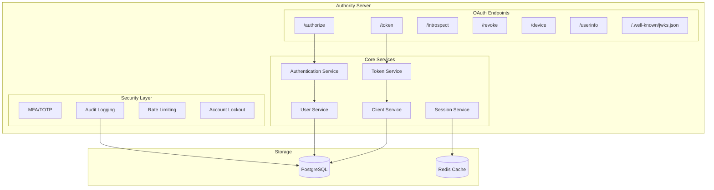
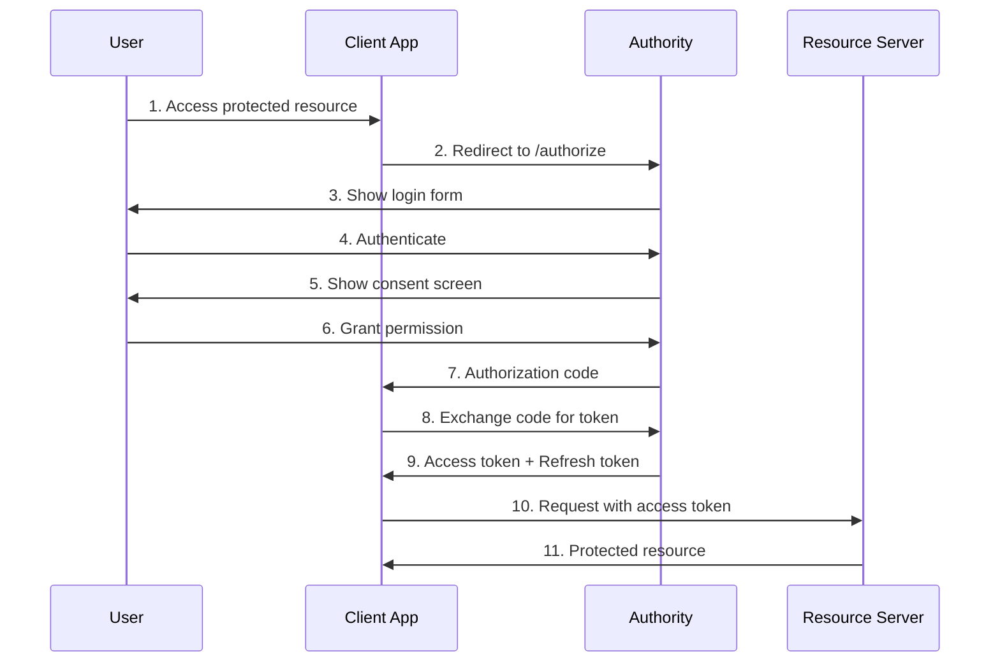

# Authority Documentation

## Introduction

Authority is a **production-ready OAuth 2.0 Server and OpenID Connect 1.0 Provider** built with the Crystal programming language. It offers robust authentication features, enterprise-grade security, and a beautiful admin dashboard for managing your authentication infrastructure.

## Architecture Overview

## Key Features

### OAuth 2.0 Grant Types

| Grant Type | Use Case | Status |
|------------|----------|--------|
| Authorization Code | Web applications with server-side code | Implemented |
| Authorization Code + PKCE | Mobile and single-page applications | Implemented |
| Client Credentials | Machine-to-machine authentication | Implemented |
| Resource Owner Password | Trusted first-party applications | Implemented |
| Implicit | Legacy browser-based applications | Implemented |
| Device Code | IoT devices, CLIs, and smart TVs | Implemented |
| Refresh Token | Long-lived access with token rotation | Implemented |

### Security Features

- **Multi-Factor Authentication (MFA)** - TOTP-based 2FA with backup codes
- **Account Lockout** - Configurable thresholds with progressive delays
- **Password Policies** - Minimum length, history, and expiry requirements
- **Session Management** - Persistent sessions with device tracking
- **Audit Logging** - Comprehensive action tracking with export capabilities
- **Token Introspection** - Validate tokens server-side
- **Token Revocation** - Revoke access and refresh tokens
- **Opaque Tokens** - Server-side token storage with rotation

### Admin Dashboard

Authority includes a modern, dark-themed admin dashboard for managing:

- **OAuth Clients** - Register and manage applications
- **Users** - Create, edit, lock/unlock accounts
- **Scopes** - Define system and custom OAuth scopes
- **Audit Logs** - Track and export all actions
- **Settings** - Configure security policies

## OAuth 2.0 Flow Overview

## Standards Compliance

Authority implements the following RFCs and specifications:

- [RFC 6749](https://tools.ietf.org/html/rfc6749) - OAuth 2.0 Authorization Framework
- [RFC 6750](https://tools.ietf.org/html/rfc6750) - Bearer Token Usage
- [RFC 7519](https://tools.ietf.org/html/rfc7519) - JSON Web Token (JWT)
- [RFC 7636](https://tools.ietf.org/html/rfc7636) - Proof Key for Code Exchange (PKCE)
- [RFC 7662](https://tools.ietf.org/html/rfc7662) - Token Introspection
- [RFC 7009](https://tools.ietf.org/html/rfc7009) - Token Revocation
- [RFC 8628](https://tools.ietf.org/html/rfc8628) - Device Authorization Grant
- [OpenID Connect Core 1.0](https://openid.net/specs/openid-connect-core-1_0.html)

## Getting Started

The following documentation will guide you through:

1. **Installation** - Set up Authority using Docker or from source
2. **Configuration** - Configure environment variables and settings
3. **Authentication** - Understand the authentication flows
4. **API Endpoints** - Learn about available endpoints
5. **Customization** - Customize the UI templates
6. **Security** - Best practices for securing your deployment

## Technology Stack

| Component | Technology |
|-----------|------------|
| Language | Crystal |
| Web Framework | Azu |
| Database | PostgreSQL |
| Templating | Crinja (Jinja2-compatible) |
| Caching | Redis (optional) |
| Authentication | Authly |
| JWT | crystal-jwt |
