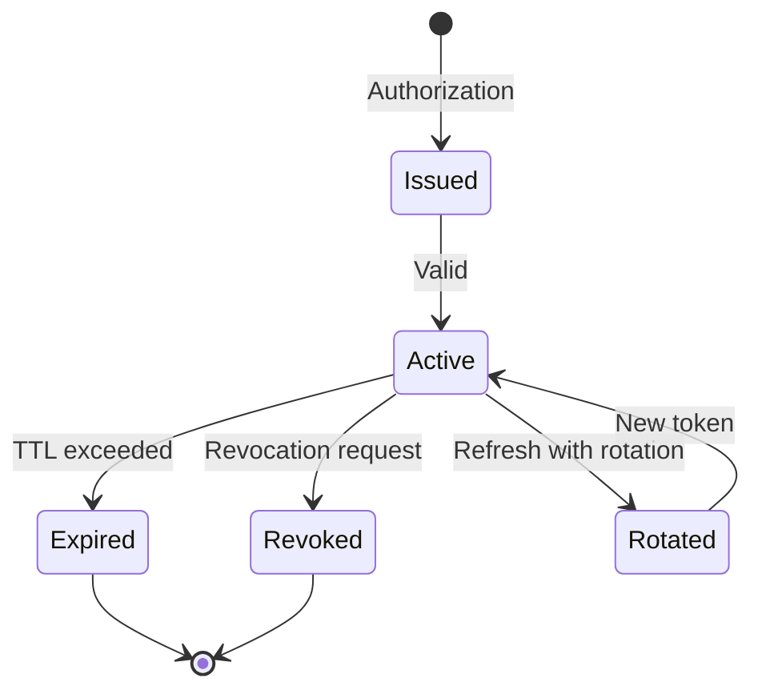

# Token Settings

Configuration options for OAuth 2.0 tokens.

## Token Lifetimes

| Variable | Default | Description |
|----------|---------|-------------|
| `ACCESS_TOKEN_TTL` | `3600` | Access token lifetime (seconds) |
| `REFRESH_TOKEN_TTL` | `2592000` | Refresh token lifetime (30 days) |
| `CODE_TTL` | `600` | Authorization code lifetime (10 min) |
| `DEVICE_CODE_TTL` | `300` | Device code lifetime (5 min) |
| `ID_TOKEN_TTL` | `3600` | ID token lifetime (1 hour) |

## Refresh Token Settings

| Variable | Default | Description |
|----------|---------|-------------|
| `REFRESH_TOKEN_ROTATION` | `true` | Rotate on refresh |
| `REFRESH_TOKEN_REUSE_INTERVAL` | `0` | Grace period for reuse (seconds) |
| `REFRESH_TOKEN_ABSOLUTE_TTL` | `31536000` | Absolute lifetime (1 year) |

## Token Format

| Variable | Default | Description |
|----------|---------|-------------|
| `ACCESS_TOKEN_FORMAT` | `jwt` | `jwt` or `opaque` |
| `JWT_ALGORITHM` | `RS256` | Signing algorithm |

## Client-Specific Overrides

Configure per-client token settings via API:

```json
{
  "client_id": "my-client",
  "access_token_ttl": 7200,
  "refresh_token_ttl": 604800,
  "refresh_token_rotation": true
}
```

## Token Claims

### Access Token Claims

| Claim | Description |
|-------|-------------|
| `iss` | Issuer (Authority URL) |
| `sub` | Subject (user ID) |
| `aud` | Audience (client ID) |
| `exp` | Expiration time |
| `iat` | Issued at time |
| `scope` | Granted scopes |
| `client_id` | Client identifier |

### ID Token Claims

| Claim | Description |
|-------|-------------|
| `iss` | Issuer |
| `sub` | Subject |
| `aud` | Audience |
| `exp` | Expiration |
| `iat` | Issued at |
| `auth_time` | Authentication time |
| `nonce` | Request nonce |
| `at_hash` | Access token hash |

## Introspection Settings

| Variable | Default | Description |
|----------|---------|-------------|
| `INTROSPECTION_CACHE_TTL` | `60` | Cache introspection results |

## Revocation Settings

| Variable | Default | Description |
|----------|---------|-------------|
| `REVOKE_REFRESH_ON_PASSWORD_CHANGE` | `true` | Revoke on password change |
| `REVOKE_ALL_ON_LOGOUT` | `false` | Revoke all tokens on logout |

## Example Configurations

### Short-Lived Tokens (High Security)

```bash
ACCESS_TOKEN_TTL=900          # 15 minutes
REFRESH_TOKEN_TTL=86400       # 1 day
REFRESH_TOKEN_ROTATION=true
CODE_TTL=300                  # 5 minutes
```

### Long-Lived Tokens (User Convenience)

```bash
ACCESS_TOKEN_TTL=86400        # 1 day
REFRESH_TOKEN_TTL=7776000     # 90 days
REFRESH_TOKEN_ROTATION=false
```

### API-Only (No Refresh)

```bash
ACCESS_TOKEN_TTL=3600         # 1 hour
REFRESH_TOKEN_TTL=0           # Disabled
```

## Token Lifecycle



## Best Practices

### Access Tokens

- Keep short-lived (15 min - 1 hour)
- Use for API authorization only
- Validate on each request

### Refresh Tokens

- Enable rotation
- Set reasonable lifetime
- Revoke on security events

### Authorization Codes

- Very short-lived (5-10 minutes)
- Single use only
- Bind to client

## Next Steps

- [Security Settings](security-settings.md) - Security configuration
- [All Options](all-options.md) - Complete reference
- [Token Lifecycle](../../explanation/token-lifecycle.md) - Conceptual overview
