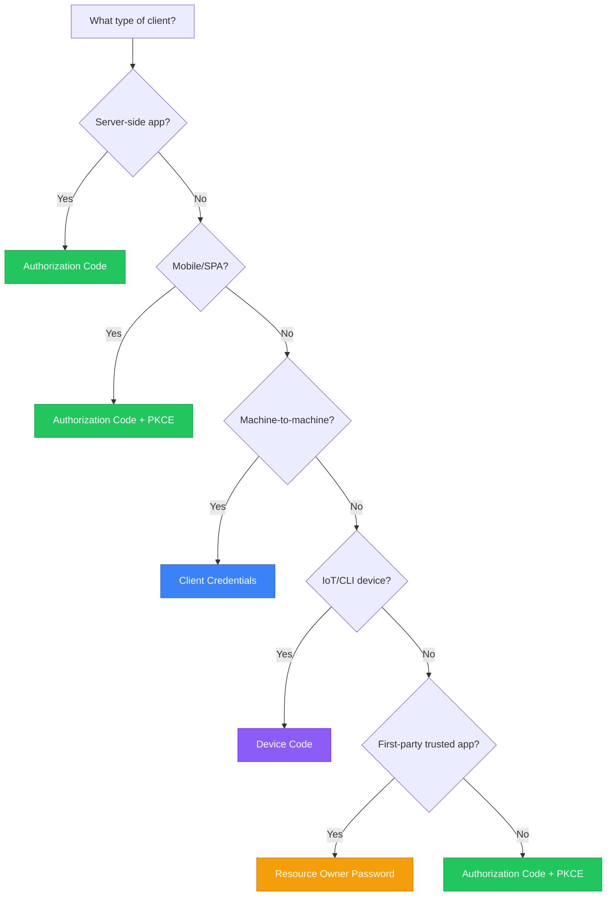
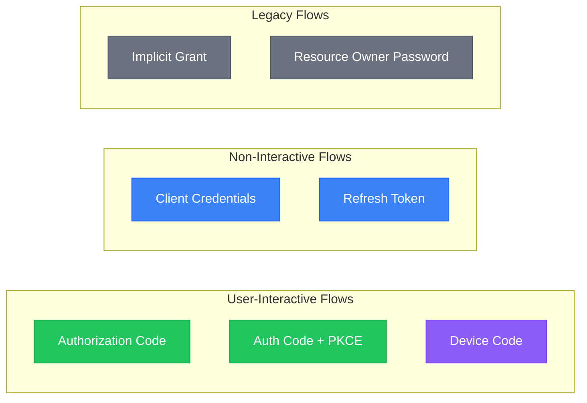

# OAuth 2 Grant Flows

A grant is a method of acquiring an access token. Deciding which grants to implement depends on the type of client the end-user will be using, and the experience you want for your users.

## Grant Type Selection Guide

## Available Grant Types

| Grant Type | Use Case | Security Level |
|------------|----------|----------------|
| **Authorization Code** | Web apps with server-side code | High |
| **Authorization Code + PKCE** | Mobile apps, SPAs | High |
| **Client Credentials** | Server-to-server | High |
| **Device Code** | IoT, CLI, Smart TVs | Medium |
| **Refresh Token** | Token renewal | High |
| **Implicit** | Legacy SPAs (deprecated) | Low |
| **Resource Owner Password** | Trusted first-party apps | Medium |

## Quick Reference

### Endpoints

| Endpoint | Method | Description |
|----------|--------|-------------|
| `/authorize` | GET | Start authorization flow |
| `/token` | POST | Exchange code for tokens |
| `/token/introspect` | POST | Validate a token |
| `/token/revoke` | POST | Revoke a token |
| `/device` | POST | Start device flow |
| `/userinfo` | GET/POST | Get user information |

## Grant Flow Documentation

Dive into the specifics of each OAuth 2 Flow implementation:


[authorization-flow.md](authorization-flow.md)



[device-flow.md](device-flow.md)



[client-credentials.md](client-credentials.md)



[refreshing-access-tokens.md](refreshing-access-tokens.md)



[access-token-response.md](access-token-response.md)


### Legacy Flows


[implicit-grant.md](implicit-grant.md)



[password.md](password.md)

