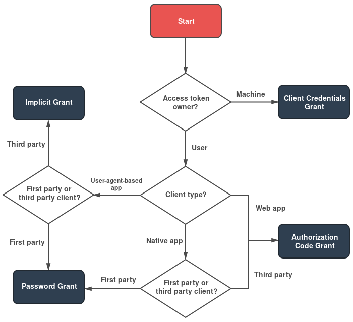

# OAuth 2 Grant Flows

A grant is a method of acquiring an access token. Deciding which grants to implement depends on the type of client the end-user will be using, and the experience you want for your users.

Dive into the specifics of each OAuth 2 Flow implementation


[device-flow.md](device-flow.md)



[authorization-flow.md](authorization-flow.md)



[implicit-grant.md](implicit-grant.md)



[client-credentials.md](client-credentials.md)



[password.md](password.md)



[refreshing-access-tokens.md](refreshing-access-tokens.md)



[access-token-response.md](access-token-response.md)

