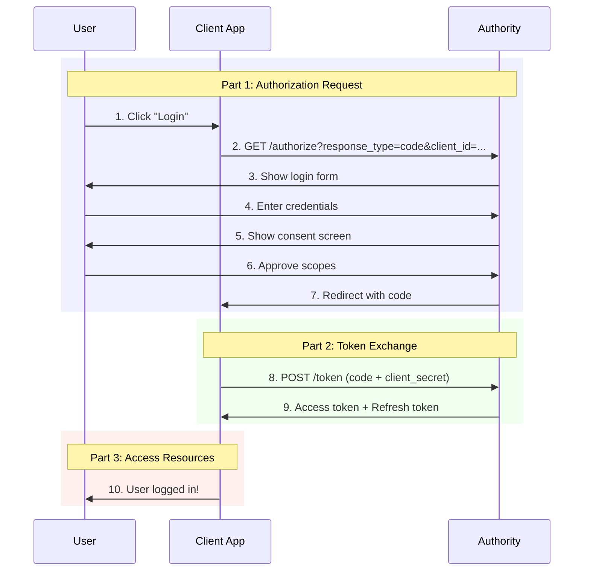

# Authorization Flow

The authorization code grant is used when an application exchanges an authorization code for an access token. After the user returns to the application via the redirect URL, the application will get the authorization code from the URL and use it to request an access token. This request will be made to the token endpoint.

## Flow Overview



### The Flow (Part One) <a href="#the-flow-part-one" id="the-flow-part-one"></a>

The client will redirect the user to the authorization server with the following parameters in the query string:

```bash
GET https://authorization-server.com/authorize?client_id=a17c21ed
&response_type=code
&state=5ca75bd30
&redirect_uri=https%3A%2F%2Fexample-app.com%2Fauth
&scope=photos
```

## Authorization Code

<mark style="color:blue;">`GET`</mark> `https://authorization-server.com/authorize`

The client will redirect the user to the authorization server with the following parameters in the query string:

#### Query Parameters

| Name                                             | Type   | Description                                                                                                                          |
| ------------------------------------------------ | ------ | ------------------------------------------------------------------------------------------------------------------------------------ |
| response\_type<mark style="color:red;">\*</mark> | String | Indicates that your server expects to receive an authorization code. Must be `code`                                                  |
| client\_id<mark style="color:red;">\*</mark>     | String | The client ID you received when you first registered the application                                                                 |
| redirect\_uri<mark style="color:red;">\*</mark>  | String | Indicates the URI to return the user to after authorization is complete                                                              |
| scope<mark style="color:red;">\*</mark>          | String | One or more scope values indicating which parts of the user's account you wish to access                                             |
| state                                            | String | with a [CSRF](https://en.wikipedia.org/wiki/Cross-site\_request\_forgery) token. This parameter is optional but highly recommended.  |



```javascript
https://example-app.com/cb?code=AUTH_CODE_HERE&state=1234zyx
```




You should first compare this state value to ensure it matches the one you started with. You can typically store the state value in a cookie or session, and compare it when the user comes back. This helps ensure your redirection endpoint isn't able to be tricked into attempting to exchange arbitrary authorization codes.


The parameters will be validated by the authorization server.

### User Authorization Prompt

The user will then be asked to sign in to the authorization server and approve the client.


The user sees the authorization prompt


If the user approves the client they will be redirected from the authorization server back to the client (specifically to the redirect URI) with the following parameters in the query string:

* `code` with the authorization code
* `state` with the state parameter sent in the original request. You should compare this value with the value stored in the user’s session to ensure the authorization code obtained is in response to requests made by this client rather than another client application.

```
https://example-app.com/cb?code=AUTH_CODE_HERE&state=1234zyx
```

### PKCE Extension

The Proof Key for Code Exchange (PKCE, pronounced pixie) extension describes a technique for public clients to mitigate the threat of having the authorization code intercepted. The technique involves the client first creating a secret, and then using that secret again when exchanging the authorization code for an access token. This way if the code is intercepted, it will not be useful since the token request relies on the initial secret.

Once the app has generated the code verifier, it uses that to create the _code challenge_. For devices that can perform a SHA256 hash, the code challenge is a BASE64-URL-encoded string of the SHA256 hash of the code verifier. Clients that do not have the ability to perform a SHA256 hash are permitted to use the plain code verifier string as the challenge.

Now that the client has a _code challenge_ string, it includes that and a parameter that indicates which method was used to generate the challenge (plain or S256) along with the standard parameters of the authorization request. This means a complete authorization request will include the following parameters.

```bash
GET https://authorization-server.com/authorize?client_id=a17c21ed
&response_type=code
&state=5ca75bd30
&redirect_uri=https%3A%2F%2Fexample-app.com%2Fauth
&scope=photos
&code_challenge=XXXXXXXX
&code_challenge_method=S256
```


The PKCE extension does not add any new responses, so clients can always use the PKCE extension even if an authorization server does not support it.


### The Flow (Part Two) <a href="#the-flow-part-two" id="the-flow-part-two"></a>

**Exchange the authorization code for an access token**

To exchange the authorization code for an access token, the app makes a POST request to the service’s token endpoint. The request will have the following parameters.

```bash
POST /oauth/token HTTP/1.1
Host: authorization-server.com
 
code=Yzk5ZDczMzRlNDEwY
&grant_type=code
&redirect_uri=https://example-app.com/cb
&client_id=mRkZGFjM
&client_secret=ZGVmMjMz
&code_verifier=a6b602d858ae0da189dacd297b188ef308dc754bd9cc359ac2e1d8d1
```

## Creates an Access Token

<mark style="color:green;">`POST`</mark> `https://my-auth-server.com/token`&#x20;

The server exchanges the authorization code for an access token by making a POST request to the token endpoint.

#### Headers

| Name                                            | Type   | Description                                                                                                                        |
| ----------------------------------------------- | ------ | ---------------------------------------------------------------------------------------------------------------------------------- |
| Authorization<mark style="color:red;">\*</mark> | String | Contains the word Basic, followed by a space and a base64-encoded(non-encrypted) string with the _client id_ and _client_ _secret_ |

#### Request Body

| Name                                            | Type   | Description                                                                                                                  |
| ----------------------------------------------- | ------ | ---------------------------------------------------------------------------------------------------------------------------- |
| grant\_type<mark style="color:red;">\*</mark>   | String | The grant type for this flow is **authorization\_code**                                                                      |
| redirect\_uri<mark style="color:red;">\*</mark> | String | Must be identical to the redirect URI provided in the original link                                                          |
| code<mark style="color:red;">\*</mark>          | String | The authorization code from the query string                                                                                 |
| code\_verifier                                  | String | PCKE Extension - the code verifier for the PKCE request, that the app originally generated before the authorization request. |



```javascript
{
  "access_token": "AYjcyMzY3ZDhiNmJkNTY",
  "refresh_token": "RjY2NjM5NzA2OWJjuE7c",
  "token_type": "Bearer",
  "expires": 3600
}
```



**OAuth Security**

Up until 2019, the OAuth 2.0 spec only recommended using the [PKCE](https://www.oauth.com/oauth2-servers/pkce/) extension for mobile and JavaScript apps. The latest OAuth Security BCP now recommends using PKCE also for server-side apps, as it provides some additional benefits there as well. It is likely to take some time before common OAuth services adapt to this new recommendation, but if you’re building a server from scratch you should definitely support PKCE for all types of clients.
