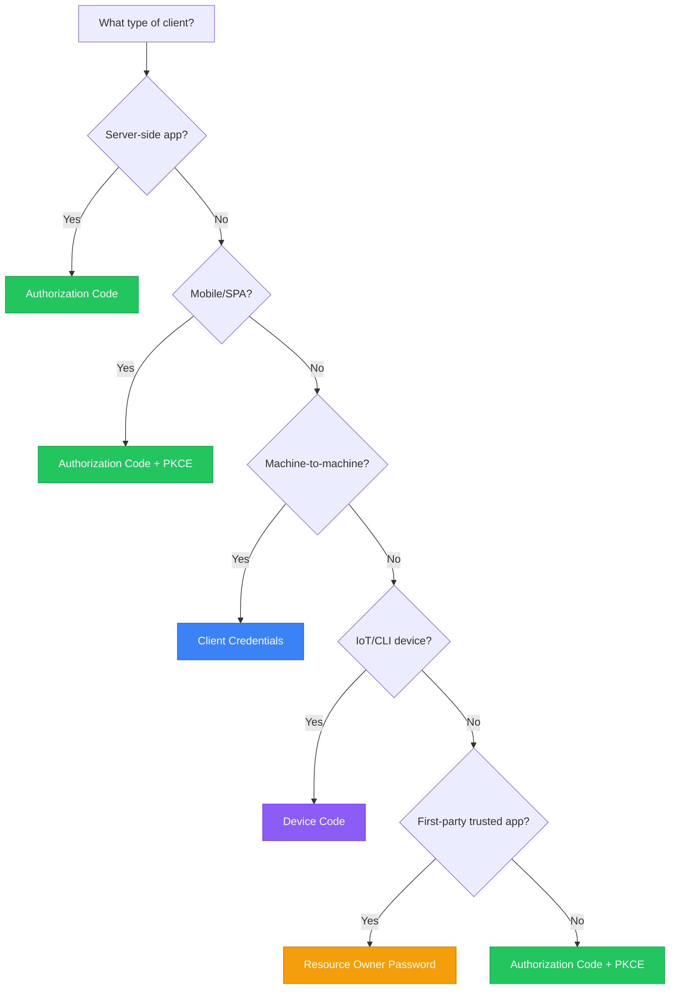
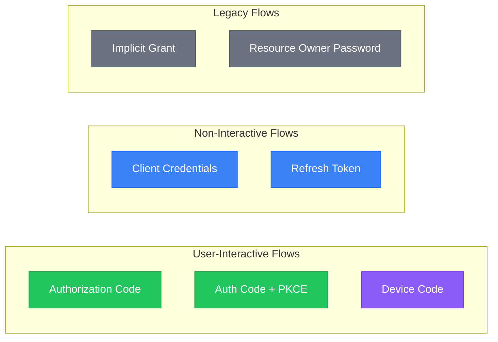

# OAuth 2.0 Reference

Complete reference for OAuth 2.0 grant types supported by Authority.

## Grant Type Overview



## Available Grant Types



## Grant Type Comparison

| Grant Type | Use Case | Client Type | Security |
|------------|----------|-------------|----------|
| [Authorization Code](authorization-code.md) | Web apps with backend | Confidential | High |
| [Authorization Code + PKCE](authorization-code-pkce.md) | Mobile apps, SPAs | Public | High |
| [Client Credentials](client-credentials.md) | Server-to-server | Confidential | High |
| [Device Code](device-flow.md) | IoT, CLI, Smart TVs | Public | Medium |
| [Refresh Token](refresh-tokens.md) | Token renewal | Both | High |
| [Implicit](legacy/implicit-grant.md) | Legacy SPAs | Public | Low |
| [Password](legacy/password-grant.md) | Trusted first-party | Confidential | Medium |

## Endpoints

| Endpoint | Method | Description |
|----------|--------|-------------|
| `/authorize` | GET | Start authorization flow |
| `/token` | POST | Exchange code for tokens |
| `/token/introspect` | POST | Validate a token |
| `/token/revoke` | POST | Revoke a token |
| `/device` | POST | Start device flow |

## Recommended Flows

### For Web Applications

Use **Authorization Code** with a backend:

```
User → Your App → Authority → Your App Backend → Token
```

### For Mobile Apps / SPAs

Use **Authorization Code + PKCE**:

```
User → Your App → Authority → Your App → Token (with PKCE)
```

### For Backend Services

Use **Client Credentials**:

```
Your Service → Authority → Token
```

### For CLI / IoT Devices

Use **Device Code**:

```
Device → Authority → User on Browser → Device polls → Token
```

## Security Recommendations


**Do:**

- Always use HTTPS
- Validate state parameter
- Use PKCE for public clients
- Store tokens securely
- Validate tokens server-side



**Avoid:**

- Implicit grant (deprecated)
- Password grant for third-party apps
- Long-lived access tokens
- Storing tokens in localStorage


## Standards

Authority implements these RFCs:

- [RFC 6749](https://tools.ietf.org/html/rfc6749) - OAuth 2.0 Framework
- [RFC 6750](https://tools.ietf.org/html/rfc6750) - Bearer Token Usage
- [RFC 7636](https://tools.ietf.org/html/rfc7636) - PKCE
- [RFC 7662](https://tools.ietf.org/html/rfc7662) - Token Introspection
- [RFC 7009](https://tools.ietf.org/html/rfc7009) - Token Revocation
- [RFC 8628](https://tools.ietf.org/html/rfc8628) - Device Authorization

## Next Steps

- [Authorization Code](authorization-code.md) - Standard web app flow
- [Authorization Code + PKCE](authorization-code-pkce.md) - Mobile/SPA flow
- [Client Credentials](client-credentials.md) - Machine-to-machine
- [Device Flow](device-flow.md) - IoT and CLI devices
