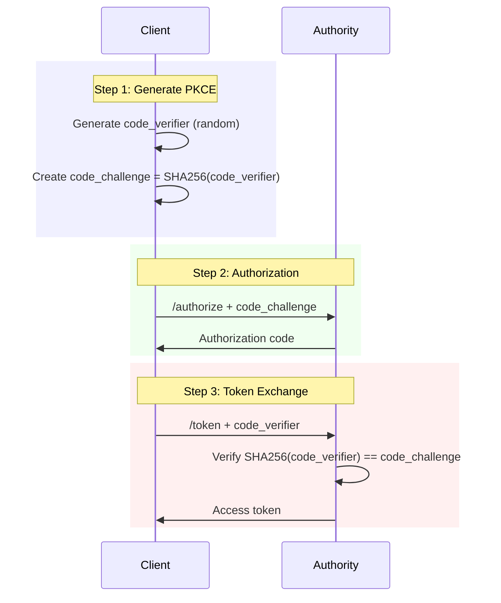

# Authorization Code + PKCE

PKCE (Proof Key for Code Exchange) extends the authorization code flow for public clients that cannot securely store a client secret.

## Overview

PKCE protects against authorization code interception attacks by using a dynamically generated secret.

## When to Use

- Mobile applications
- Single-page applications (SPAs)
- Desktop applications
- Any client that cannot securely store secrets

## Flow Diagram



## PKCE Parameters

| Parameter | Description |
|-----------|-------------|
| `code_verifier` | Random string 43-128 characters |
| `code_challenge` | Base64URL(SHA256(code_verifier)) |
| `code_challenge_method` | `S256` (recommended) or `plain` |

## Generate PKCE Values

### JavaScript

```javascript
function generateCodeVerifier() {
  const array = new Uint8Array(32);
  crypto.getRandomValues(array);
  return base64URLEncode(array);
}

async function generateCodeChallenge(verifier) {
  const encoder = new TextEncoder();
  const data = encoder.encode(verifier);
  const hash = await crypto.subtle.digest('SHA-256', data);
  return base64URLEncode(new Uint8Array(hash));
}

function base64URLEncode(buffer) {
  return btoa(String.fromCharCode(...buffer))
    .replace(/\+/g, '-')
    .replace(/\//g, '_')
    .replace(/=/g, '');
}
```

### Python

```python
import hashlib
import base64
import secrets

def generate_code_verifier():
    return secrets.token_urlsafe(32)

def generate_code_challenge(verifier):
    digest = hashlib.sha256(verifier.encode()).digest()
    return base64.urlsafe_b64encode(digest).rstrip(b'=').decode()
```

## Authorization Request

<mark style="color:blue;">`GET`</mark> `/authorize`

### Parameters

| Parameter | Required | Description |
|-----------|----------|-------------|
| `response_type` | Yes | Must be `code` |
| `client_id` | Yes | Your client identifier |
| `redirect_uri` | Yes | Callback URL |
| `scope` | Yes | Space-separated scopes |
| `state` | Recommended | CSRF protection |
| `code_challenge` | Yes | Base64URL(SHA256(verifier)) |
| `code_challenge_method` | Yes | `S256` |

### Example

```bash
GET https://auth.example.com/authorize?
  response_type=code
  &client_id=abc123
  &redirect_uri=https://app.example.com/callback
  &scope=openid%20profile%20email
  &state=xyz789
  &code_challenge=E9Melhoa2OwvFrEMTJguCHaoeK1t8URWbuGJSstw-cM
  &code_challenge_method=S256
```

## Token Request

<mark style="color:green;">`POST`</mark> `/token`

### Parameters

| Parameter | Required | Description |
|-----------|----------|-------------|
| `grant_type` | Yes | `authorization_code` |
| `code` | Yes | Authorization code |
| `redirect_uri` | Yes | Same as authorization |
| `client_id` | Yes | Client identifier |
| `code_verifier` | Yes | Original code verifier |

### Example

```bash
POST /token HTTP/1.1
Host: auth.example.com
Content-Type: application/x-www-form-urlencoded

grant_type=authorization_code
&code=AUTH_CODE_HERE
&redirect_uri=https://app.example.com/callback
&client_id=abc123
&code_verifier=dBjftJeZ4CVP-mB92K27uhbUJU1p1r_wW1gFWFOEjXk
```


Note: No `client_secret` is required for public clients with PKCE.


## Complete Example

### React SPA

```javascript
import { useEffect, useState } from 'react';

const CLIENT_ID = 'your_client_id';
const REDIRECT_URI = 'http://localhost:3000/callback';
const AUTHORITY_URL = 'https://auth.example.com';

function App() {
  const [user, setUser] = useState(null);

  useEffect(() => {
    // Check for callback
    if (window.location.search.includes('code=')) {
      handleCallback();
    }
  }, []);

  async function login() {
    const codeVerifier = generateCodeVerifier();
    const codeChallenge = await generateCodeChallenge(codeVerifier);
    const state = generateCodeVerifier();

    // Store for callback
    sessionStorage.setItem('code_verifier', codeVerifier);
    sessionStorage.setItem('state', state);

    const params = new URLSearchParams({
      response_type: 'code',
      client_id: CLIENT_ID,
      redirect_uri: REDIRECT_URI,
      scope: 'openid profile email',
      state: state,
      code_challenge: codeChallenge,
      code_challenge_method: 'S256'
    });

    window.location.href = `${AUTHORITY_URL}/authorize?${params}`;
  }

  async function handleCallback() {
    const params = new URLSearchParams(window.location.search);
    const code = params.get('code');
    const state = params.get('state');

    // Verify state
    if (state !== sessionStorage.getItem('state')) {
      throw new Error('Invalid state');
    }

    const codeVerifier = sessionStorage.getItem('code_verifier');

    // Exchange code for tokens
    const response = await fetch(`${AUTHORITY_URL}/token`, {
      method: 'POST',
      headers: { 'Content-Type': 'application/x-www-form-urlencoded' },
      body: new URLSearchParams({
        grant_type: 'authorization_code',
        code: code,
        redirect_uri: REDIRECT_URI,
        client_id: CLIENT_ID,
        code_verifier: codeVerifier
      })
    });

    const tokens = await response.json();

    // Get user info
    const userResponse = await fetch(`${AUTHORITY_URL}/userinfo`, {
      headers: { 'Authorization': `Bearer ${tokens.access_token}` }
    });

    setUser(await userResponse.json());

    // Clean up
    sessionStorage.removeItem('code_verifier');
    sessionStorage.removeItem('state');
    window.history.replaceState({}, '', '/');
  }

  return (
    <div>
      {user ? (
        <p>Welcome, {user.name}!</p>
      ) : (
        <button onClick={login}>Login</button>
      )}
    </div>
  );
}
```

### Mobile (React Native)

```javascript
import * as AuthSession from 'expo-auth-session';
import * as Crypto from 'expo-crypto';

const CLIENT_ID = 'your_client_id';
const AUTHORITY_URL = 'https://auth.example.com';

async function login() {
  const codeVerifier = generateCodeVerifier();
  const codeChallenge = await generateCodeChallenge(codeVerifier);

  const redirectUri = AuthSession.makeRedirectUri();

  const result = await AuthSession.startAsync({
    authUrl: `${AUTHORITY_URL}/authorize?` + new URLSearchParams({
      response_type: 'code',
      client_id: CLIENT_ID,
      redirect_uri: redirectUri,
      scope: 'openid profile email',
      code_challenge: codeChallenge,
      code_challenge_method: 'S256'
    })
  });

  if (result.type === 'success') {
    const tokens = await exchangeCode(result.params.code, codeVerifier, redirectUri);
    return tokens;
  }
}
```

## Security Benefits

PKCE prevents:

1. **Authorization code interception** - Attacker cannot use stolen code without verifier
2. **Redirect hijacking** - Code is useless without the original verifier
3. **Man-in-the-middle attacks** - Verifier is never transmitted before token exchange

## Best Practices


- Always use `S256` method (not `plain`)
- Generate cryptographically random verifiers
- Store verifier securely during flow
- Clear verifier after token exchange


## Next Steps

- [Authorization Code](authorization-code.md) - Confidential clients
- [Refresh Tokens](refresh-tokens.md) - Token renewal
- [Token Response](token-response.md) - Response format
