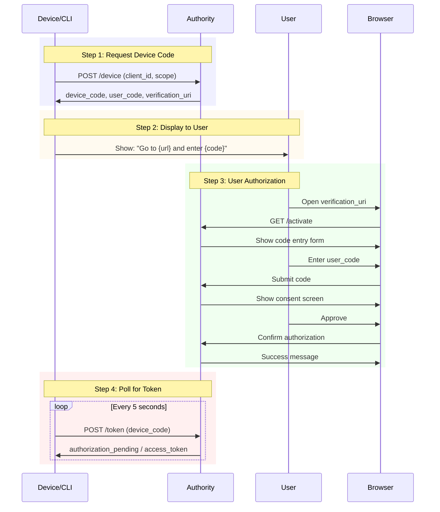

# Device Authorization Flow

The device authorization flow enables OAuth on devices that have limited input capabilities, such as smart TVs, IoT devices, and CLIs.

## Overview

This flow allows devices without a browser to authenticate users by directing them to complete authorization on a secondary device (phone or computer).

## Use Cases

- Smart TVs
- Media consoles
- Picture frames
- Printers
- CLI applications
- IoT devices

## Flow Diagram



## Device Authorization Request

<mark style="color:green;">`POST`</mark> `/device`

### Parameters

| Parameter | Required | Description |
|-----------|----------|-------------|
| `client_id` | Yes | Client identifier |
| `scope` | Optional | Requested scopes |

### Example

```bash
POST /device HTTP/1.1
Host: auth.example.com
Content-Type: application/x-www-form-urlencoded

client_id=cli_client&scope=openid%20profile
```

### Response

```json
{
  "device_code": "e2623df1-8594-47b4-b528-41ed3daecc1a",
  "user_code": "WDJB-MJHT",
  "verification_uri": "https://auth.example.com/activate",
  "verification_uri_complete": "https://auth.example.com/activate?user_code=WDJB-MJHT",
  "expires_in": 300,
  "interval": 5
}
```

| Field | Description |
|-------|-------------|
| `device_code` | Code for token polling (keep secret) |
| `user_code` | Code user enters (6-8 characters) |
| `verification_uri` | URL user visits |
| `verification_uri_complete` | URL with code pre-filled |
| `expires_in` | Seconds until codes expire |
| `interval` | Minimum polling interval |

## Display to User

Show the user:

```
To sign in, visit:

  https://auth.example.com/activate

And enter the code:

  WDJB-MJHT

Waiting for authorization...
```

Or display a QR code linking to `verification_uri_complete`.

## Token Polling

<mark style="color:green;">`POST`</mark> `/token`

Poll the token endpoint while waiting for user authorization.

### Parameters

| Parameter | Required | Description |
|-----------|----------|-------------|
| `grant_type` | Yes | `urn:ietf:params:oauth:grant-type:device_code` |
| `device_code` | Yes | Device code from initial response |
| `client_id` | Yes | Client identifier |

### Example

```bash
POST /token HTTP/1.1
Host: auth.example.com
Content-Type: application/x-www-form-urlencoded

grant_type=urn:ietf:params:oauth:grant-type:device_code
&device_code=e2623df1-8594-47b4-b528-41ed3daecc1a
&client_id=cli_client
```

### Responses

**Authorization Pending:**

```json
{
  "error": "authorization_pending",
  "error_description": "The user has not yet completed authorization"
}
```

**Slow Down (polling too fast):**

```json
{
  "error": "slow_down",
  "error_description": "Polling too frequently"
}
```

**Success:**

```json
{
  "access_token": "eyJhbGciOiJSUzI1NiIs...",
  "token_type": "Bearer",
  "expires_in": 3600,
  "refresh_token": "dGhpcyBpcyBhIHJlZnJlc2g...",
  "scope": "openid profile"
}
```

**Access Denied:**

```json
{
  "error": "access_denied",
  "error_description": "The user denied authorization"
}
```

**Expired Token:**

```json
{
  "error": "expired_token",
  "error_description": "The device code has expired"
}
```

## Complete Example

### CLI Application (Node.js)

```javascript
const CLIENT_ID = 'cli_client';
const AUTHORITY_URL = 'https://auth.example.com';

async function login() {
  // Step 1: Get device code
  const deviceResponse = await fetch(`${AUTHORITY_URL}/device`, {
    method: 'POST',
    headers: { 'Content-Type': 'application/x-www-form-urlencoded' },
    body: new URLSearchParams({
      client_id: CLIENT_ID,
      scope: 'openid profile email'
    })
  });

  const device = await deviceResponse.json();

  // Step 2: Display to user
  console.log('\nTo sign in, visit:');
  console.log(`  ${device.verification_uri}`);
  console.log('\nAnd enter the code:');
  console.log(`  ${device.user_code}`);
  console.log('\nWaiting for authorization...\n');

  // Step 3: Poll for token
  const interval = device.interval * 1000;
  const expiresAt = Date.now() + (device.expires_in * 1000);

  while (Date.now() < expiresAt) {
    await sleep(interval);

    const tokenResponse = await fetch(`${AUTHORITY_URL}/token`, {
      method: 'POST',
      headers: { 'Content-Type': 'application/x-www-form-urlencoded' },
      body: new URLSearchParams({
        grant_type: 'urn:ietf:params:oauth:grant-type:device_code',
        device_code: device.device_code,
        client_id: CLIENT_ID
      })
    });

    const result = await tokenResponse.json();

    if (result.access_token) {
      console.log('Login successful!');
      return result;
    }

    if (result.error === 'authorization_pending') {
      process.stdout.write('.');
      continue;
    }

    if (result.error === 'slow_down') {
      await sleep(5000); // Additional delay
      continue;
    }

    throw new Error(result.error_description || result.error);
  }

  throw new Error('Device code expired');
}

function sleep(ms) {
  return new Promise(resolve => setTimeout(resolve, ms));
}

// Run
login()
  .then(tokens => console.log('Access token:', tokens.access_token))
  .catch(err => console.error('Error:', err.message));
```

### Python CLI

```python
import requests
import time

CLIENT_ID = 'cli_client'
AUTHORITY_URL = 'https://auth.example.com'

def login():
    # Step 1: Get device code
    response = requests.post(
        f'{AUTHORITY_URL}/device',
        data={
            'client_id': CLIENT_ID,
            'scope': 'openid profile email'
        }
    )
    device = response.json()

    # Step 2: Display to user
    print(f"\nTo sign in, visit:\n  {device['verification_uri']}")
    print(f"\nAnd enter the code:\n  {device['user_code']}")
    print("\nWaiting for authorization...")

    # Step 3: Poll for token
    interval = device['interval']
    expires_at = time.time() + device['expires_in']

    while time.time() < expires_at:
        time.sleep(interval)

        response = requests.post(
            f'{AUTHORITY_URL}/token',
            data={
                'grant_type': 'urn:ietf:params:oauth:grant-type:device_code',
                'device_code': device['device_code'],
                'client_id': CLIENT_ID
            }
        )

        result = response.json()

        if 'access_token' in result:
            print("\nLogin successful!")
            return result

        if result.get('error') == 'authorization_pending':
            print('.', end='', flush=True)
            continue

        if result.get('error') == 'slow_down':
            time.sleep(5)
            continue

        raise Exception(result.get('error_description', result.get('error')))

    raise Exception('Device code expired')

if __name__ == '__main__':
    tokens = login()
    print(f"Access token: {tokens['access_token']}")
```

## User Experience

The activation page shows:

```
Enter the code displayed on your device:

┌─────────────────────────────────┐
│          WDJB-MJHT              │
└─────────────────────────────────┘

                [Continue]
```

After entering the code, users see the standard consent screen.

## Security Considerations


- **Protect device_code** - It's equivalent to an authorization code
- **Respect interval** - Don't poll faster than specified
- **Handle expiration** - Start over if codes expire
- **Use HTTPS** - All communication must be encrypted


## Next Steps

- [Token Response](token-response.md) - Response format
- [Refresh Tokens](refresh-tokens.md) - Token renewal
- [Error Codes](../api/error-codes.md) - Error handling
