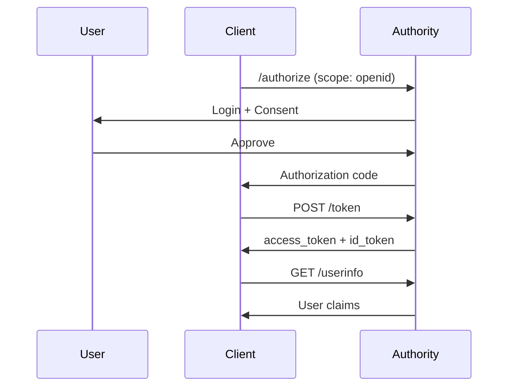

# OpenID Connect Reference

OpenID Connect (OIDC) adds identity layer on top of OAuth 2.0, providing user authentication.

## Overview

While OAuth 2.0 provides authorization, OpenID Connect adds:

- **Authentication** - Verify user identity
- **ID Tokens** - User information in JWT format
- **UserInfo Endpoint** - Fetch additional user claims
- **Discovery** - Automatic configuration

## Endpoints

| Endpoint | Description |
|----------|-------------|
| `/.well-known/openid-configuration` | Discovery document |
| `/.well-known/jwks.json` | Public keys for verification |
| `/userinfo` | User claims endpoint |
| `/authorize` | Authorization (with OIDC scopes) |
| `/token` | Token (returns ID token) |

## Scopes

Request OIDC scopes to get identity information:

| Scope | Claims |
|-------|--------|
| `openid` | `sub` (required for OIDC) |
| `profile` | `name`, `family_name`, `given_name`, `picture`, etc. |
| `email` | `email`, `email_verified` |
| `address` | `address` |
| `phone` | `phone_number`, `phone_number_verified` |

## Flow



## ID Token

The ID token is a JWT containing user identity:

```json
{
  "iss": "https://auth.example.com",
  "sub": "user-uuid",
  "aud": "client-id",
  "exp": 1699999999,
  "iat": 1699996399,
  "auth_time": 1699996300,
  "nonce": "abc123",
  "name": "John Doe",
  "email": "john@example.com",
  "email_verified": true
}
```

See [ID Tokens](id-tokens.md) for full specification.

## UserInfo Response

```json
{
  "sub": "user-uuid",
  "name": "John Doe",
  "given_name": "John",
  "family_name": "Doe",
  "email": "john@example.com",
  "email_verified": true,
  "picture": "https://..."
}
```

See [UserInfo](userinfo.md) for details.

## Discovery

Automatic configuration via:

```
GET /.well-known/openid-configuration
```

Response includes all endpoints, supported scopes, algorithms, etc.

See [Discovery](discovery.md) for full specification.

## Authentication vs Authorization

| Aspect | OAuth 2.0 | OpenID Connect |
|--------|-----------|----------------|
| Purpose | Authorization | Authentication |
| Token | Access token | ID token |
| Question answered | "What can they do?" | "Who are they?" |
| Scope | Custom scopes | `openid`, `profile`, etc. |

## Basic Implementation

```javascript
// 1. Request authorization with openid scope
const params = new URLSearchParams({
  response_type: 'code',
  client_id: CLIENT_ID,
  redirect_uri: REDIRECT_URI,
  scope: 'openid profile email',
  state: state,
  nonce: nonce  // For ID token validation
});

window.location = `${AUTHORITY_URL}/authorize?${params}`;

// 2. Exchange code for tokens
const tokens = await fetch('/token', {
  method: 'POST',
  body: new URLSearchParams({
    grant_type: 'authorization_code',
    code: code,
    redirect_uri: REDIRECT_URI
  })
}).then(r => r.json());

// 3. Validate and use ID token
const idToken = parseIdToken(tokens.id_token);
console.log('User:', idToken.name);

// 4. Optionally fetch more claims
const userinfo = await fetch('/userinfo', {
  headers: { 'Authorization': `Bearer ${tokens.access_token}` }
}).then(r => r.json());
```

## Standards

Authority implements:

- [OpenID Connect Core 1.0](https://openid.net/specs/openid-connect-core-1_0.html)
- [OpenID Connect Discovery 1.0](https://openid.net/specs/openid-connect-discovery-1_0.html)
- [OpenID Connect Dynamic Client Registration 1.0](https://openid.net/specs/openid-connect-registration-1_0.html)

## Next Steps

- [Discovery](discovery.md) - Automatic configuration
- [JWKS](jwks.md) - Token verification keys
- [UserInfo](userinfo.md) - User claims endpoint
- [ID Tokens](id-tokens.md) - Token specification
