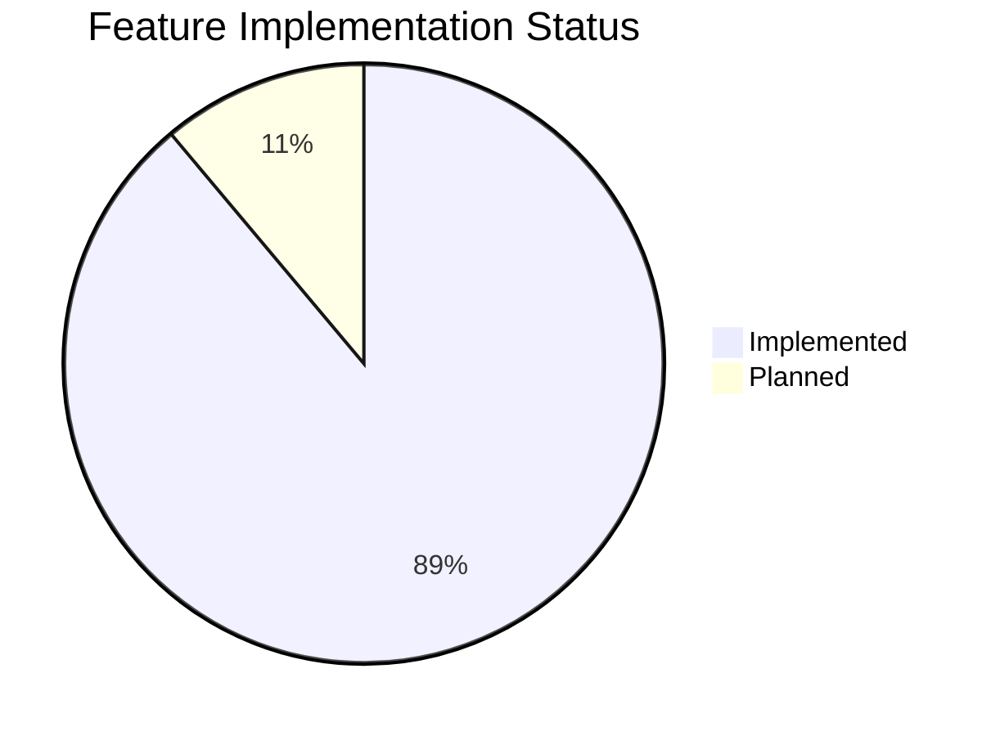
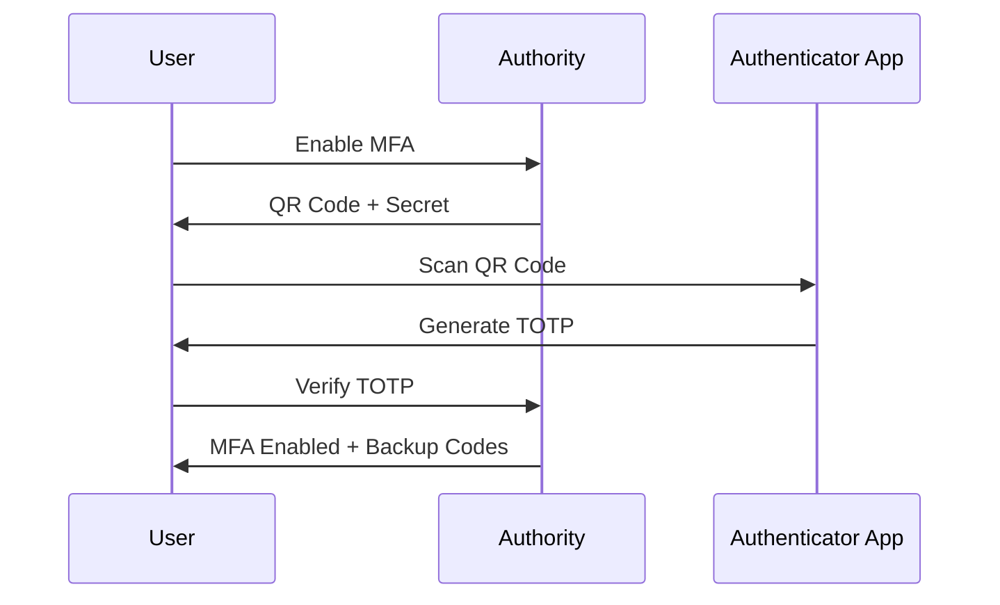

# Roadmap / Features

## Feature Status



## Implemented Features

### OAuth 2.0 Grant Types

- [x] Authorization code grant
- [x] Client credentials grant
- [x] Implicit grant
- [x] Resource owner credentials grant
- [x] Refresh token grant
- [x] Device Code grant

### OpenID Connect

- [x] OpenID Connect Core
- [x] PKCE (Proof Key for Code Exchange)
- [x] JSON Web Tokens (JWT)
- [x] JWKS Endpoint

### Token Management

- [x] Token Introspection
- [x] Token Revocation
- [x] Opaque Tokens with rotation
- [x] Refresh Token Rotation

### Security Features

- [x] Multi-Factor Authentication (MFA/TOTP)
- [x] Account Lockout with configurable thresholds
- [x] Password Policies (length, history, expiry)
- [x] Session Management
- [x] Audit Logging with export

### User Management

- [x] Account recovery & verification
- [x] Email verification
- [x] Password reset flow
- [x] User profile management

### Admin Features

- [x] Permission and Role Management (admin/user roles)
- [x] Admin Dashboard
- [x] OAuth Client Management
- [x] Scope Management
- [x] System Settings Configuration
- [x] Audit Log Viewer with filtering and export

## Planned Features

- [ ] Client SDKs (JavaScript, Python, Ruby)
- [ ] Social Sign-in (Google, GitHub, etc.)

## Feature Details

### Multi-Factor Authentication

Authority now supports TOTP-based two-factor authentication:



### Audit Logging

All administrative actions are logged with:

- Actor (who performed the action)
- Action type (created, updated, deleted)
- Resource type and ID
- Timestamp
- IP Address
- Changes made

### Token Introspection

Validate tokens server-side following RFC 7662:

```bash
POST /token/introspect
Content-Type: application/x-www-form-urlencoded

token=ACCESS_TOKEN&token_type_hint=access_token
```

### Token Revocation

Revoke tokens following RFC 7009:

```bash
POST /token/revoke
Content-Type: application/x-www-form-urlencoded

token=ACCESS_TOKEN&token_type_hint=access_token
```
