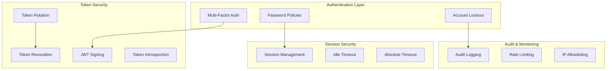
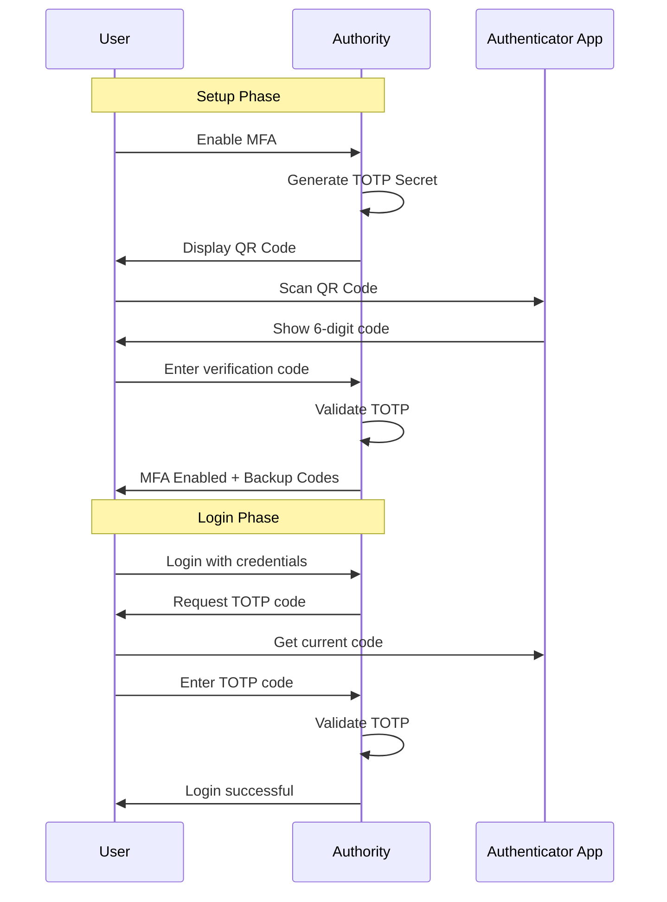
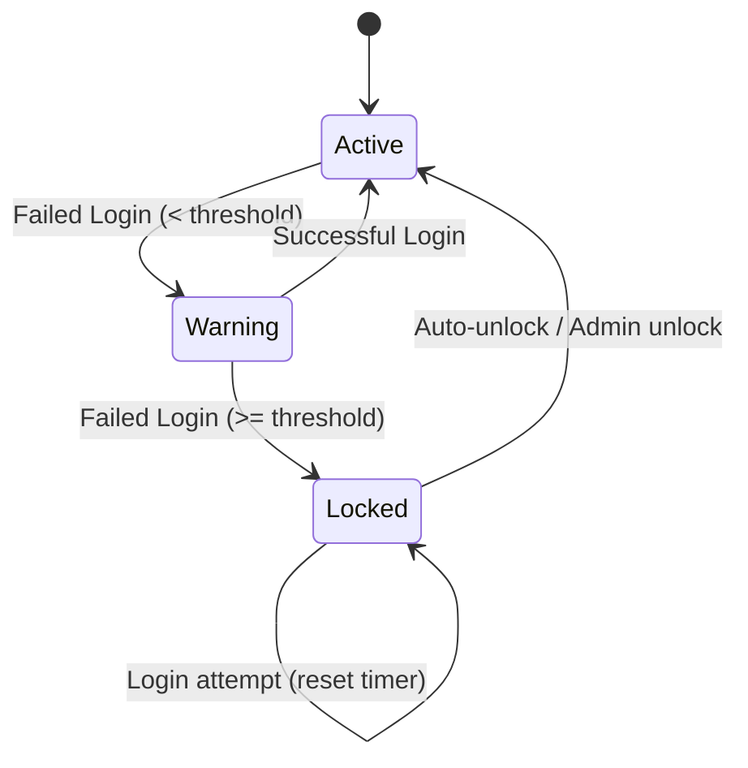
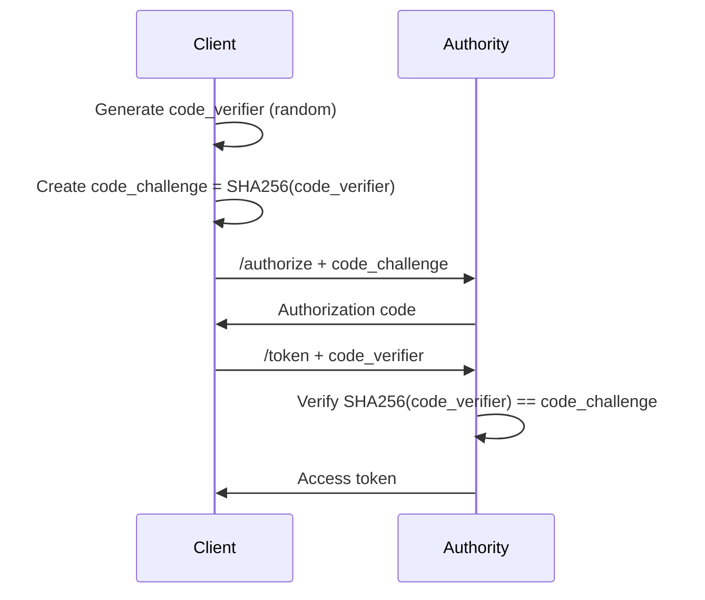

# Security

Security is a critical aspect of the Authority authentication system. Authority implements multiple layers of security to protect your users and applications.

## Security Architecture



## Multi-Factor Authentication (MFA)

Authority supports TOTP-based two-factor authentication using apps like Google Authenticator, Authy, or 1Password.

### MFA Flow



### Backup Codes

When MFA is enabled, Authority generates one-time backup codes that can be used if the user loses access to their authenticator app.

## Account Lockout

Protect against brute-force attacks with configurable account lockout:

| Setting | Default | Description |
|---------|---------|-------------|
| `LOCKOUT_THRESHOLD` | 5 | Failed attempts before lockout |
| `LOCKOUT_DURATION` | 30 | Minutes until auto-unlock |
| `ENABLE_AUTO_UNLOCK` | true | Automatically unlock after duration |

### Lockout Behavior



## Password Policies

Enforce strong password requirements:

| Setting | Default | Description |
|---------|---------|-------------|
| `PASSWORD_MIN_LENGTH` | 12 | Minimum password length |
| `PASSWORD_HISTORY_COUNT` | 5 | Prevent reuse of recent passwords |
| `PASSWORD_EXPIRY_DAYS` | 0 | Days until password expires (0 = never) |
| `REQUIRE_UPPERCASE` | true | Require uppercase letters |
| `REQUIRE_LOWERCASE` | true | Require lowercase letters |
| `REQUIRE_NUMBERS` | true | Require numeric digits |
| `REQUIRE_SPECIAL` | false | Require special characters |

## Token Security

### JWT Configuration

Authority uses RS256 (RSA + SHA-256) for signing JWTs:

- **Access Tokens**: Short-lived (default: 1 hour)
- **Refresh Tokens**: Long-lived (default: 30 days)
- **Authorization Codes**: Very short-lived (default: 10 minutes)

### Token Rotation

Refresh token rotation is enabled by default. When a refresh token is used:

1. A new access token is issued
2. A new refresh token is issued
3. The old refresh token is invalidated

This limits the damage if a refresh token is compromised.

### Token Revocation

Revoke tokens when:
- User logs out
- User changes password
- Admin revokes user session
- Suspicious activity detected

```bash
POST /token/revoke
Content-Type: application/x-www-form-urlencoded

token=REFRESH_TOKEN&token_type_hint=refresh_token
```

### Token Introspection

Validate tokens server-side:

```bash
POST /token/introspect
Content-Type: application/x-www-form-urlencoded

token=ACCESS_TOKEN&token_type_hint=access_token
```

Response:
```json
{
  "active": true,
  "client_id": "my-client",
  "username": "user@example.com",
  "scope": "read write",
  "exp": 1699999999
}
```

## Session Management

### Session Settings

| Setting | Default | Description |
|---------|---------|-------------|
| `SESSION_DURATION_DAYS` | 7 | Maximum session lifetime |
| `IDLE_TIMEOUT_MINUTES` | 30 | Timeout after inactivity |
| `SINGLE_SESSION` | false | Allow only one active session |

### Active Sessions

Users can view and revoke their active sessions from the profile page. Each session tracks:

- Device information (browser, OS)
- IP address
- Last activity time
- Login time

## Audit Logging

All security-relevant actions are logged:

### Logged Events

| Event | Description |
|-------|-------------|
| `user.login` | Successful login |
| `user.login_failed` | Failed login attempt |
| `user.logout` | User logout |
| `user.created` | New user registration |
| `user.updated` | Profile update |
| `user.locked` | Account locked |
| `user.unlocked` | Account unlocked |
| `mfa.enabled` | MFA enabled |
| `mfa.disabled` | MFA disabled |
| `token.revoked` | Token revocation |
| `client.created` | OAuth client created |
| `client.updated` | OAuth client updated |
| `client.deleted` | OAuth client deleted |

### Audit Log Fields

Each log entry includes:
- Timestamp
- Actor (user or system)
- Action type
- Resource type and ID
- IP address
- User agent
- Changes made (for updates)

## PKCE (Proof Key for Code Exchange)

PKCE protects authorization code flow against interception attacks:



## Best Practices

### Deployment

1. **Always use HTTPS** - Never expose Authority over plain HTTP
2. **Use strong secrets** - Generate cryptographically secure `SECRET_KEY_BASE`
3. **Limit token lifetimes** - Use short-lived access tokens
4. **Enable MFA** - Require MFA for admin accounts
5. **Monitor audit logs** - Review logs regularly for suspicious activity

### Client Configuration

1. **Use confidential clients** when possible (server-side apps)
2. **Always use PKCE** for public clients (mobile, SPA)
3. **Validate redirect URIs** - Register exact URIs, avoid wildcards
4. **Request minimal scopes** - Only request what you need

### Token Handling

1. **Never expose tokens** in URLs or logs
2. **Store securely** - Use secure storage (Keychain, encrypted storage)
3. **Validate tokens** server-side when in doubt
4. **Handle revocation** - Clear tokens on logout
