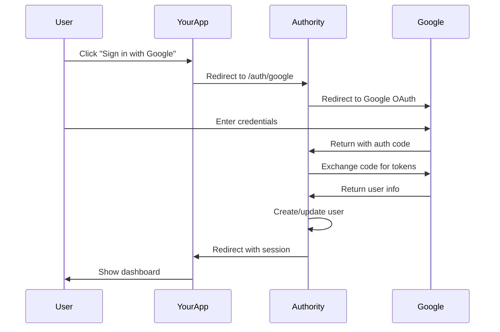

# Add Social Login

Learn how to add "Sign in with Google" to your application in under 10 minutes.

## What You'll Build

By the end of this tutorial, you'll have:
- Google OAuth configured in Authority
- A working "Sign in with Google" button
- Users automatically created from Google accounts

## Prerequisites

- Authority running locally or deployed
- A Google account for testing
- Basic web development knowledge

## Step 1: Create a Google OAuth App

1. Go to [Google Cloud Console](https://console.cloud.google.com/)

2. Create a new project:
   - Click the project dropdown at the top
   - Click **New Project**
   - Name it (e.g., "My App Auth")
   - Click **Create**

3. Enable the OAuth consent screen:
   - Navigate to **APIs & Services** > **OAuth consent screen**
   - Select **External** user type
   - Click **Create**
   - Fill in required fields:
     - App name: Your app name
     - User support email: Your email
     - Developer contact: Your email
   - Click **Save and Continue** through remaining steps

4. Create OAuth credentials:
   - Navigate to **APIs & Services** > **Credentials**
   - Click **Create Credentials** > **OAuth client ID**
   - Application type: **Web application**
   - Name: "Authority Integration"
   - Authorized redirect URIs: `http://localhost:4000/auth/google/callback`
   - Click **Create**

5. Copy your **Client ID** and **Client Secret**

## Step 2: Configure Authority

1. Log in to your Authority admin dashboard at `http://localhost:4000/dashboard`

2. Navigate to **Settings** > **Social Login**

3. Find the Google section and configure:
   - Toggle **Enable Google OAuth** to ON
   - Paste your **Client ID**
   - Paste your **Client Secret**

4. Click **Save**

## Step 3: Test the Integration

1. Open a new incognito/private browser window

2. Navigate to `http://localhost:4000/auth/google`

3. You should be redirected to Google's sign-in page

4. Sign in with your Google account

5. After approval, you'll be redirected back to Authority

6. Check the admin dashboard - a new user should appear!

## Step 4: Add to Your Application

Add a sign-in button to your app:

```html
<!DOCTYPE html>
<html>
<head>
  <title>My App</title>
  <style>
    .btn-google {
      display: inline-flex;
      align-items: center;
      padding: 12px 24px;
      background: #4285f4;
      color: white;
      border-radius: 4px;
      text-decoration: none;
      font-family: sans-serif;
      font-weight: 500;
    }
    .btn-google:hover {
      background: #357abd;
    }
    .btn-google svg {
      margin-right: 12px;
    }
  </style>
</head>
<body>
  <h1>Welcome to My App</h1>

  <a href="http://localhost:4000/auth/google" class="btn-google">
    <svg width="18" height="18" viewBox="0 0 18 18" fill="none">
      <path d="M17.64 9.2c0-.637-.057-1.251-.164-1.84H9v3.481h4.844c-.209 1.125-.843 2.078-1.796 2.717v2.258h2.908c1.702-1.567 2.684-3.874 2.684-6.615z" fill="#4285F4"/>
      <path d="M9.003 18c2.43 0 4.467-.806 5.956-2.18l-2.909-2.26c-.806.54-1.836.86-3.047.86-2.344 0-4.328-1.584-5.036-3.711H.957v2.332A8.997 8.997 0 009.003 18z" fill="#34A853"/>
      <path d="M3.964 10.712A5.41 5.41 0 013.682 9c0-.593.102-1.17.282-1.71V4.958H.957A8.996 8.996 0 000 9c0 1.452.348 2.827.957 4.042l3.007-2.33z" fill="#FBBC05"/>
      <path d="M9.003 3.58c1.321 0 2.508.454 3.44 1.345l2.582-2.58C13.464.891 11.428 0 9.002 0A8.997 8.997 0 00.957 4.958L3.964 7.29c.708-2.127 2.692-3.71 5.036-3.71z" fill="#EA4335"/>
    </svg>
    Sign in with Google
  </a>
</body>
</html>
```

## Step 5: Handle the Redirect

After successful authentication, redirect users to your app:

```javascript
// Encode your callback URL
const callbackUrl = 'http://localhost:3000/dashboard';
const encodedUrl = btoa(callbackUrl);

// Build the auth URL with forward_url
const authUrl = `http://localhost:4000/auth/google?forward_url=${encodedUrl}`;

// Use this URL for your button
document.querySelector('.btn-google').href = authUrl;
```

After authentication, Authority will redirect users to your specified URL with an active session.

## What Happens Behind the Scenes



## Adding More Providers

Now that Google is working, add more providers:

1. **GitHub**: [Configure GitHub](../how-to/social-login/configure-github.md)
2. **Facebook**: [Configure Facebook](../how-to/social-login/configure-facebook.md)
3. **LinkedIn**: [Configure LinkedIn](../how-to/social-login/configure-linkedin.md)
4. **Apple**: [Configure Apple](../how-to/social-login/configure-apple.md)

## Common Issues

### "redirect_uri_mismatch"

Your callback URL doesn't match Google's configuration.

**Fix:** Ensure the redirect URI in Google Console exactly matches:
```
http://localhost:4000/auth/google/callback
```

### "Access blocked: App not verified"

You're not a test user for an unverified app.

**Fix:** In Google Console, go to OAuth consent screen > Test users and add your email.

### User Created But No Session

Check that your forward_url is correctly encoded.

**Fix:** Use `btoa()` to Base64 encode the URL.

## Next Steps

- [Manage Linked Accounts](../how-to/social-login/manage-linked-accounts.md) - Let users link multiple providers
- [Enable MFA](../how-to/security/enable-mfa.md) - Add extra security
- [First OAuth Integration](first-oauth-integration.md) - Full OAuth client setup
