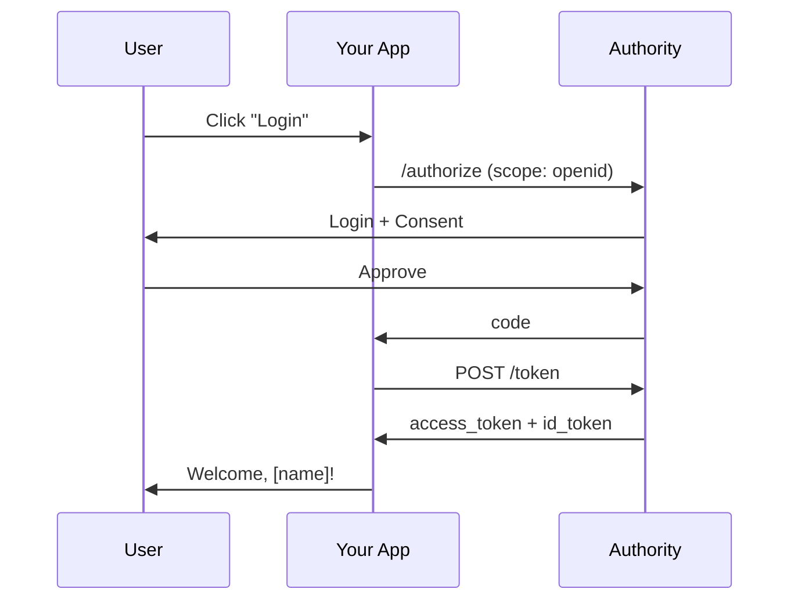

# Add User Authentication

Implement user login and registration in your application using OpenID Connect.

## Prerequisites

- Completed [First OAuth Integration](first-oauth-integration.md)
- Understanding of OAuth 2.0 authorization code flow

## What You'll Learn

- Use OpenID Connect for user authentication
- Parse and validate ID tokens
- Display user profile information
- Handle sessions and logout

## OpenID Connect Overview

OpenID Connect adds an identity layer on top of OAuth 2.0. Instead of just getting an access token, you also receive an **ID token** containing user information.



## Step 1: Request OpenID Scopes

Add `openid` and profile scopes to your authorization request:

```javascript
const params = new URLSearchParams({
  response_type: 'code',
  client_id: CLIENT_ID,
  redirect_uri: REDIRECT_URI,
  scope: 'openid profile email',  // OpenID Connect scopes
  state: state,
  code_challenge: codeChallenge,
  code_challenge_method: 'S256'
});
```

### Available Scopes

| Scope | Claims Included |
|-------|-----------------|
| `openid` | `sub` (required for OIDC) |
| `profile` | `name`, `family_name`, `given_name`, `picture` |
| `email` | `email`, `email_verified` |
| `address` | `address` |
| `phone` | `phone_number`, `phone_number_verified` |

## Step 2: Parse the ID Token

The token response now includes an ID token:

```json
{
  "access_token": "eyJhbGciOiJSUzI1NiIs...",
  "id_token": "eyJhbGciOiJSUzI1NiIs...",
  "token_type": "Bearer",
  "expires_in": 3600,
  "scope": "openid profile email"
}
```

Decode the ID token (it's a JWT):

```javascript
function parseIdToken(idToken) {
  const parts = idToken.split('.');
  const payload = JSON.parse(atob(parts[1]));
  return payload;
}

// Result:
// {
//   "iss": "http://localhost:4000",
//   "sub": "user-uuid",
//   "aud": "your_client_id",
//   "exp": 1699999999,
//   "iat": 1699996399,
//   "name": "John Doe",
//   "email": "john@example.com",
//   "email_verified": true
// }
```

## Step 3: Validate the ID Token

Always validate ID tokens before trusting them:

```javascript
async function validateIdToken(idToken) {
  const payload = parseIdToken(idToken);

  // 1. Verify issuer
  if (payload.iss !== AUTHORITY_URL) {
    throw new Error('Invalid issuer');
  }

  // 2. Verify audience
  if (payload.aud !== CLIENT_ID) {
    throw new Error('Invalid audience');
  }

  // 3. Verify expiration
  if (payload.exp < Date.now() / 1000) {
    throw new Error('Token expired');
  }

  // 4. Verify signature (use JWKS)
  await verifySignature(idToken);

  return payload;
}
```

## Step 4: Fetch Additional User Info

Use the UserInfo endpoint for more claims:

```javascript
async function getUserInfo(accessToken) {
  const response = await fetch(`${AUTHORITY_URL}/userinfo`, {
    headers: {
      'Authorization': `Bearer ${accessToken}`
    }
  });

  if (!response.ok) {
    throw new Error('Failed to fetch user info');
  }

  return response.json();
}

// Result:
// {
//   "sub": "user-uuid",
//   "name": "John Doe",
//   "given_name": "John",
//   "family_name": "Doe",
//   "email": "john@example.com",
//   "email_verified": true,
//   "picture": "https://..."
// }
```

## Step 5: Implement Session Management

### Store Session Securely

```javascript
class AuthSession {
  constructor() {
    this.tokens = null;
    this.user = null;
  }

  login(tokens, user) {
    this.tokens = tokens;
    this.user = user;

    // Store refresh token securely (httpOnly cookie recommended)
    localStorage.setItem('auth_session', JSON.stringify({
      accessToken: tokens.access_token,
      expiresAt: Date.now() + (tokens.expires_in * 1000),
      user: user
    }));
  }

  getAccessToken() {
    const session = JSON.parse(localStorage.getItem('auth_session'));
    if (!session) return null;

    if (Date.now() > session.expiresAt) {
      // Token expired - need to refresh
      return null;
    }

    return session.accessToken;
  }

  getUser() {
    const session = JSON.parse(localStorage.getItem('auth_session'));
    return session?.user;
  }

  logout() {
    localStorage.removeItem('auth_session');
    this.tokens = null;
    this.user = null;
  }
}

const auth = new AuthSession();
```

### Display User Profile

```html
<div id="profile" style="display: none;">
  
  <h2 id="name"></h2>
  <p id="email"></p>
  <button id="logout">Logout</button>
</div>

<script>
function showProfile(user) {
  document.getElementById('profile').style.display = 'block';
  document.getElementById('avatar').src = user.picture || '/default-avatar.png';
  document.getElementById('name').textContent = user.name;
  document.getElementById('email').textContent = user.email;
}

document.getElementById('logout').onclick = () => {
  auth.logout();
  window.location.href = '/';
};
</script>
```

## Step 6: Implement Logout

### Client-Side Logout

```javascript
function logout() {
  auth.logout();
  window.location.href = '/';
}
```

### RP-Initiated Logout (Optional)

Authority supports OpenID Connect RP-Initiated Logout:

```javascript
function logoutWithRedirect() {
  auth.logout();

  const params = new URLSearchParams({
    post_logout_redirect_uri: 'http://localhost:3000',
    client_id: CLIENT_ID
  });

  window.location.href = `${AUTHORITY_URL}/logout?${params}`;
}
```

## Complete Implementation

```javascript
class AuthClient {
  constructor(config) {
    this.clientId = config.clientId;
    this.redirectUri = config.redirectUri;
    this.authorityUrl = config.authorityUrl;
    this.session = new AuthSession();
  }

  async login() {
    const codeVerifier = this.generateCodeVerifier();
    const codeChallenge = await this.generateCodeChallenge(codeVerifier);
    const state = this.generateCodeVerifier();

    sessionStorage.setItem('pkce_verifier', codeVerifier);
    sessionStorage.setItem('oauth_state', state);

    const params = new URLSearchParams({
      response_type: 'code',
      client_id: this.clientId,
      redirect_uri: this.redirectUri,
      scope: 'openid profile email',
      state: state,
      code_challenge: codeChallenge,
      code_challenge_method: 'S256'
    });

    window.location.href = `${this.authorityUrl}/authorize?${params}`;
  }

  async handleCallback() {
    const params = new URLSearchParams(window.location.search);
    const code = params.get('code');
    const state = params.get('state');

    if (state !== sessionStorage.getItem('oauth_state')) {
      throw new Error('Invalid state');
    }

    const codeVerifier = sessionStorage.getItem('pkce_verifier');
    const tokens = await this.exchangeCode(code, codeVerifier);
    const user = await this.getUserInfo(tokens.access_token);

    this.session.login(tokens, user);

    // Clean up
    sessionStorage.removeItem('pkce_verifier');
    sessionStorage.removeItem('oauth_state');
    window.history.replaceState({}, '', window.location.pathname);

    return user;
  }

  async exchangeCode(code, codeVerifier) {
    const response = await fetch(`${this.authorityUrl}/token`, {
      method: 'POST',
      headers: { 'Content-Type': 'application/x-www-form-urlencoded' },
      body: new URLSearchParams({
        grant_type: 'authorization_code',
        code: code,
        redirect_uri: this.redirectUri,
        client_id: this.clientId,
        code_verifier: codeVerifier
      })
    });
    return response.json();
  }

  async getUserInfo(accessToken) {
    const response = await fetch(`${this.authorityUrl}/userinfo`, {
      headers: { 'Authorization': `Bearer ${accessToken}` }
    });
    return response.json();
  }

  logout() {
    this.session.logout();
  }

  isAuthenticated() {
    return this.session.getAccessToken() !== null;
  }

  getUser() {
    return this.session.getUser();
  }

  // PKCE helpers
  generateCodeVerifier() {
    const array = new Uint8Array(32);
    crypto.getRandomValues(array);
    return this.base64URLEncode(array);
  }

  async generateCodeChallenge(verifier) {
    const data = new TextEncoder().encode(verifier);
    const hash = await crypto.subtle.digest('SHA-256', data);
    return this.base64URLEncode(new Uint8Array(hash));
  }

  base64URLEncode(buffer) {
    return btoa(String.fromCharCode(...buffer))
      .replace(/\+/g, '-').replace(/\//g, '_').replace(/=/g, '');
  }
}

// Usage
const auth = new AuthClient({
  clientId: 'your_client_id',
  redirectUri: 'http://localhost:3000/callback',
  authorityUrl: 'http://localhost:4000'
});

if (window.location.search.includes('code=')) {
  auth.handleCallback().then(user => {
    console.log('Logged in as:', user.name);
  });
}
```

## Next Steps

- [OpenID Connect Reference](../reference/openid-connect/README.md) - Full specification
- [ID Tokens](../reference/openid-connect/id-tokens.md) - Token structure
- [UserInfo Endpoint](../reference/openid-connect/userinfo.md) - Available claims
