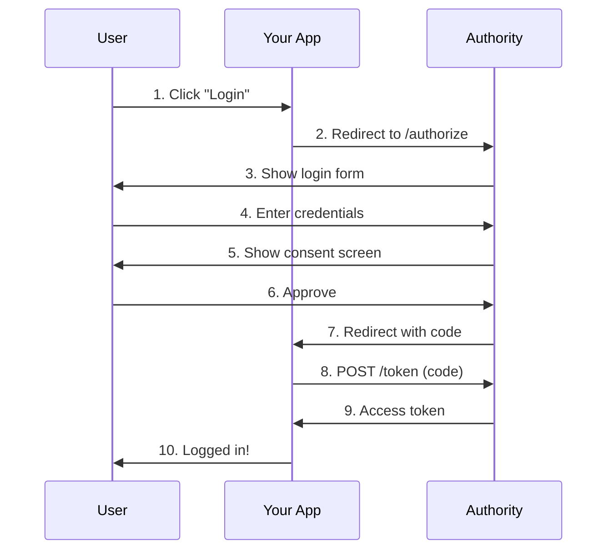

# First OAuth Integration

Build a complete OAuth 2.0 integration from scratch. You'll implement the authorization code flow with PKCE.

## Prerequisites

- Completed [Quick Start](quick-start.md)
- Authority running on `http://localhost:4000`
- An OAuth client created with:
  - **Redirect URI:** `http://localhost:3000/callback`

## What You'll Build

A simple web application that:
1. Redirects users to Authority for authentication
2. Receives an authorization code
3. Exchanges the code for access tokens
4. Uses tokens to access protected resources

## The Authorization Code Flow



## Step 1: Generate PKCE Values

PKCE protects against authorization code interception. Generate a code verifier and challenge:

```javascript
// Generate random code verifier
function generateCodeVerifier() {
  const array = new Uint8Array(32);
  crypto.getRandomValues(array);
  return base64URLEncode(array);
}

// Create code challenge from verifier
async function generateCodeChallenge(verifier) {
  const encoder = new TextEncoder();
  const data = encoder.encode(verifier);
  const hash = await crypto.subtle.digest('SHA-256', data);
  return base64URLEncode(new Uint8Array(hash));
}

function base64URLEncode(buffer) {
  return btoa(String.fromCharCode(...buffer))
    .replace(/\+/g, '-')
    .replace(/\//g, '_')
    .replace(/=/g, '');
}
```

## Step 2: Redirect to Authorization Endpoint

Build the authorization URL and redirect the user:

```javascript
const CLIENT_ID = 'your_client_id';
const REDIRECT_URI = 'http://localhost:3000/callback';
const AUTHORITY_URL = 'http://localhost:4000';

async function login() {
  const codeVerifier = generateCodeVerifier();
  const codeChallenge = await generateCodeChallenge(codeVerifier);
  const state = generateCodeVerifier(); // Random state for CSRF protection

  // Store for later
  sessionStorage.setItem('code_verifier', codeVerifier);
  sessionStorage.setItem('state', state);

  const params = new URLSearchParams({
    response_type: 'code',
    client_id: CLIENT_ID,
    redirect_uri: REDIRECT_URI,
    scope: 'openid profile email',
    state: state,
    code_challenge: codeChallenge,
    code_challenge_method: 'S256'
  });

  window.location.href = `${AUTHORITY_URL}/authorize?${params}`;
}
```

## Step 3: Handle the Callback

After the user authenticates, Authority redirects to your callback URL:

```javascript
// On your callback page
async function handleCallback() {
  const params = new URLSearchParams(window.location.search);
  const code = params.get('code');
  const state = params.get('state');

  // Verify state matches
  if (state !== sessionStorage.getItem('state')) {
    throw new Error('Invalid state parameter');
  }

  // Get stored code verifier
  const codeVerifier = sessionStorage.getItem('code_verifier');

  // Exchange code for tokens
  const tokens = await exchangeCode(code, codeVerifier);
  console.log('Access token:', tokens.access_token);
}
```

## Step 4: Exchange Code for Tokens

Make a POST request to the token endpoint:

```javascript
async function exchangeCode(code, codeVerifier) {
  const response = await fetch(`${AUTHORITY_URL}/token`, {
    method: 'POST',
    headers: {
      'Content-Type': 'application/x-www-form-urlencoded'
    },
    body: new URLSearchParams({
      grant_type: 'authorization_code',
      code: code,
      redirect_uri: REDIRECT_URI,
      client_id: CLIENT_ID,
      code_verifier: codeVerifier
    })
  });

  if (!response.ok) {
    throw new Error('Token exchange failed');
  }

  return response.json();
}
```

The response contains:

```json
{
  "access_token": "eyJhbGciOiJSUzI1NiIsInR5cCI6IkpXVCJ9...",
  "token_type": "Bearer",
  "expires_in": 3600,
  "refresh_token": "dGhpcyBpcyBhIHJlZnJlc2ggdG9rZW4...",
  "scope": "openid profile email"
}
```

## Step 5: Use the Access Token

Include the token in API requests:

```javascript
async function fetchUserInfo(accessToken) {
  const response = await fetch(`${AUTHORITY_URL}/userinfo`, {
    headers: {
      'Authorization': `Bearer ${accessToken}`
    }
  });

  return response.json();
}

// Result:
// {
//   "sub": "user-uuid",
//   "name": "John Doe",
//   "email": "john@example.com"
// }
```

## Complete Example

Here's a minimal HTML page implementing the full flow:

```html
<!DOCTYPE html>
<html>
<head>
  <title>OAuth Demo</title>
</head>
<body>
  <button id="login">Login with Authority</button>
  <div id="user"></div>

  <script>
    const CLIENT_ID = 'your_client_id';
    const REDIRECT_URI = 'http://localhost:3000/callback';
    const AUTHORITY_URL = 'http://localhost:4000';

    // Check if this is a callback
    if (window.location.search.includes('code=')) {
      handleCallback();
    }

    document.getElementById('login').onclick = login;

    async function login() {
      const codeVerifier = generateCodeVerifier();
      const codeChallenge = await generateCodeChallenge(codeVerifier);
      const state = generateCodeVerifier();

      sessionStorage.setItem('code_verifier', codeVerifier);
      sessionStorage.setItem('state', state);

      const params = new URLSearchParams({
        response_type: 'code',
        client_id: CLIENT_ID,
        redirect_uri: REDIRECT_URI,
        scope: 'openid profile email',
        state: state,
        code_challenge: codeChallenge,
        code_challenge_method: 'S256'
      });

      window.location.href = `${AUTHORITY_URL}/authorize?${params}`;
    }

    async function handleCallback() {
      const params = new URLSearchParams(window.location.search);
      const code = params.get('code');
      const state = params.get('state');

      if (state !== sessionStorage.getItem('state')) {
        alert('Invalid state');
        return;
      }

      const codeVerifier = sessionStorage.getItem('code_verifier');

      const tokenResponse = await fetch(`${AUTHORITY_URL}/token`, {
        method: 'POST',
        headers: { 'Content-Type': 'application/x-www-form-urlencoded' },
        body: new URLSearchParams({
          grant_type: 'authorization_code',
          code: code,
          redirect_uri: REDIRECT_URI,
          client_id: CLIENT_ID,
          code_verifier: codeVerifier
        })
      });

      const tokens = await tokenResponse.json();

      const userResponse = await fetch(`${AUTHORITY_URL}/userinfo`, {
        headers: { 'Authorization': `Bearer ${tokens.access_token}` }
      });

      const user = await userResponse.json();
      document.getElementById('user').textContent = `Welcome, ${user.name}!`;
    }

    function generateCodeVerifier() {
      const array = new Uint8Array(32);
      crypto.getRandomValues(array);
      return base64URLEncode(array);
    }

    async function generateCodeChallenge(verifier) {
      const data = new TextEncoder().encode(verifier);
      const hash = await crypto.subtle.digest('SHA-256', data);
      return base64URLEncode(new Uint8Array(hash));
    }

    function base64URLEncode(buffer) {
      return btoa(String.fromCharCode(...buffer))
        .replace(/\+/g, '-').replace(/\//g, '_').replace(/=/g, '');
    }
  </script>
</body>
</html>
```

## Next Steps

- [Protect Your API](protect-your-api.md) - Validate tokens on your server
- [Authorization Code Reference](../reference/oauth2/authorization-code.md) - Full specification
- [PKCE Reference](../reference/oauth2/authorization-code-pkce.md) - PKCE details
